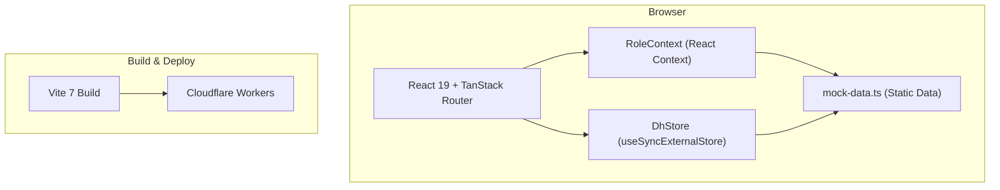
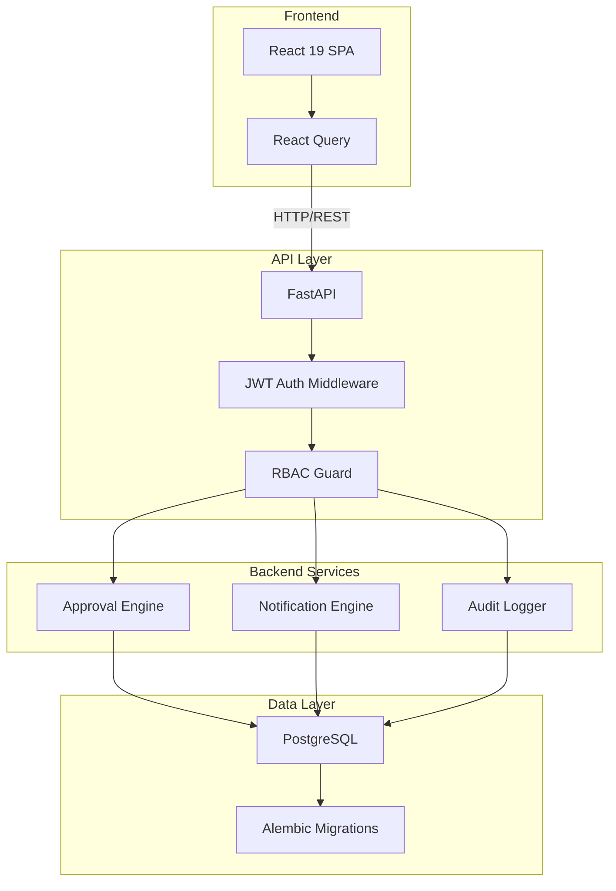

# System Architecture

> **Status:** Frontend-only (backend planned)  
> **Last Updated:** 2026-06-16

---

## Architecture Overview

Project Compass currently operates as a **frontend-only SPA** with all business logic and data embedded in the client bundle. The planned architecture transitions to a **3-tier system** with a React frontend, FastAPI backend, and PostgreSQL database.

### Current Architecture (Frontend-Only)



### Planned Architecture (Full Stack)



---

## Frontend Architecture Layers

### 1. Routing Layer
- **Technology:** TanStack Router (file-based routing)
- **Route file:** `apps/frontend/src/routeTree.gen.ts` (auto-generated)
- **Pattern:** Each route is a `.tsx` file in `apps/frontend/src/routes/`
- **Nested routes:** `clients.index.tsx`, `clients.$clientId.tsx`, `projects.index.tsx`, `projects.$projectId.tsx`

### 2. State Management Layer
- **RoleContext** (`apps/frontend/src/lib/role-context.tsx`): Provides current role, user, filtered clients/projects/issues/timesheets
- **DhStore** (`apps/frontend/src/lib/dh-store.ts`): Singleton store using `useSyncExternalStore` for Dhanshree-specific workflows (issues, alerts, escalations, interviews, prerequisites, project stages, timesheets, approvals, invoices, resources)

### 3. Data Layer
- **mock-data.ts** (`apps/frontend/src/lib/mock-data.ts`): Static TypeScript exports for People, Clients, Projects, Tasks, WBS, Issues, Timesheets, Invoices, WBS Requests, Allocation History, PM Buckets, Bench Resources
- **dh-store.ts** (`apps/frontend/src/lib/dh-store.ts`): Extended data model with runtime mutations (creates, updates via store methods)

### 4. UI Component Layer
- **shadcn/ui:** Pre-built accessible components (Dialog, Select, Tabs, Tooltip, etc.)
- **Custom components:** `app-shell.tsx`, `app-sidebar.tsx`, `app-topbar.tsx`, `stage-tracker.tsx`, `pills.tsx`, `mobile-tabs.tsx`
- **Styling:** Tailwind CSS v4 with CSS variables for theming

### 5. Utility Layer
- **utils.ts:** `cn()` (class merging via clsx + tailwind-merge)
- **dh-helpers.ts:** Project team derivation, department mapping, task metadata, allocation helpers

---

## Key Technical Decisions

| Decision | Choice | Rationale |
|----------|--------|-----------|
| Framework | TanStack Start | SSR capability, file routing, built-in Query integration |
| Styling | Tailwind CSS v4 | Utility-first, design token support |
| Components | shadcn/ui | Accessible, customizable, no vendor lock |
| Charts | Recharts | React-native charting, composable |
| Forms | React Hook Form + Zod | Type-safe validation |
| State | Context + useSyncExternalStore | Lightweight, no external state lib needed |
| Build | Vite 7 | Fast HMR, native ESM |
| Deploy | Cloudflare Workers | Edge deployment, serverless |

---

## File Structure

```
apps/frontend/src/
├── components/
│   ├── ui/                    # shadcn/ui components
│   ├── app-shell.tsx          # Layout wrapper (sidebar + topbar + content)
│   ├── app-sidebar.tsx        # Role-aware navigation sidebar
│   ├── app-topbar.tsx         # Header with role switcher, search, notifications
│   ├── stage-tracker.tsx      # Visual project stage progression
│   ├── pills.tsx              # Status badges, progress bars, avatars
│   └── mobile-tabs.tsx        # Mobile bottom navigation
├── hooks/
│   └── use-mobile.tsx         # Responsive breakpoint hook
├── lib/
│   ├── mock-data.ts           # All static data models & exports
│   ├── dh-store.ts            # Dhanshree workflow store (80KB)
│   ├── dh-helpers.ts          # Helper functions for team derivation
│   ├── role-context.tsx       # Role provider & consumer
│   ├── utils.ts               # cn() utility
│   ├── error-capture.ts       # Error boundary helpers
│   └── error-page.ts          # Error page content
├── routes/
│   ├── __root.tsx             # Root layout (QueryClient, RoleProvider)
│   ├── index.tsx              # Dashboard
│   ├── clients.index.tsx      # Client list
│   ├── clients.$clientId.tsx  # Client detail
│   ├── projects.index.tsx     # Project list (Dhanshree)
│   ├── projects.new.tsx       # New project form (Dhanshree)
│   ├── projects.$projectId.tsx # Project detail (3193 lines)
│   ├── portfolio.tsx          # Portfolio view
│   ├── wbs-allocation.tsx     # WBS intake & allocation (PMO)
│   ├── resources.tsx          # Resource directory
│   ├── health.tsx             # Health & governance
│   ├── approvals.tsx          # Timesheet approvals
│   ├── reports.tsx            # Analytics reports
│   ├── timesheet.tsx          # Timesheet entry
│   ├── allocation.tsx         # Allocation view
│   ├── action-centre.tsx      # Action centre (Dhanshree)
│   ├── customers.tsx          # Customer management (Dhanshree)
│   ├── dh-reports.tsx         # Reports (Dhanshree)
│   └── dh-resources.tsx       # Resource management (Dhanshree)
├── router.tsx                 # Router configuration
├── server.ts                  # TanStack Start server handler
├── start.ts                   # Entry point
└── styles.css                 # Global styles + Tailwind imports
```

---

## Dependencies

See [[07_Frontend_Architecture]] for the complete dependency analysis.

---

## Related Documents

- [[07_Frontend_Architecture]]
- [[22_Backend_Architecture_Draft]]
- [[20_Database_Design_Draft]]
- [[21_API_Design_Draft]]
