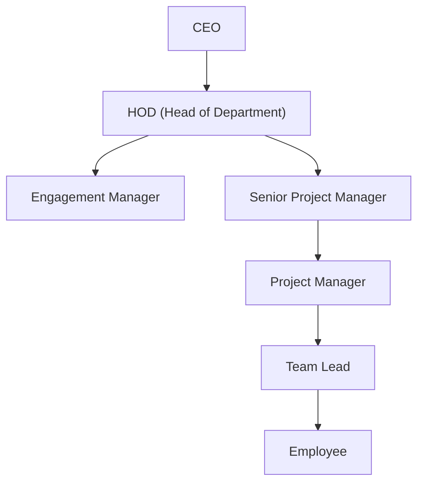

# Organization Hierarchy

> **Last Updated:** 2026-06-16

---

## Hierarchy Structure

---

## Functional Departments

Based on the `dh-helpers.ts` department mapping:

| Department | Sub-Department | Roles |
|-----------|---------------|-------|
| **Leadership** | Executive | Business Owner (CEO) |
| **Leadership** | Department Head | HOD |
| **Delivery** | Engagement | Engagement Manager |
| **Delivery** | Senior Management | Senior Project Manager |
| **Delivery** | Project Management | Project Manager |
| **Engineering** | Team Leadership | Team Lead |
| **Engineering** | Backend / Frontend | Engineer |
| **Design** | Product Design | Designer |
| **Operations** | PMO | PMO Officer |
| **Operations** | Delivery Ops | Dhanshree (Delivery Operations) |

---

## Cross-Functional Roles

| Role | Department | Reports To | Manages |
|------|-----------|-----------|---------|
| **Sales** | Sales | CEO/HOD | Client acquisition, WBS creation |
| **Accounts** | Finance | HOD | Invoice validation, payment tracking |
| **HR** | Human Resources | HOD | Onboarding, offboarding, compliance |
| **PMO** | Operations | HOD | Governance, resource allocation, monitoring |

---

## People Registry (Mock Data)

| ID | Name | Role | Department | Email |
|----|------|------|-----------|-------|
| u1 | Aarav Mehta | Senior PM | Delivery | aarav@acme.co |
| u2 | Riya Kapoor | Engagement Manager | Delivery | riya@acme.co |
| u3 | Vikram Shah | PM | Delivery | vikram@acme.co |
| u4 | Sana Iyer | PM | Delivery | sana@acme.co |
| u5 | Nikhil Rao | TL | Engineering | nikhil@acme.co |
| u6 | Priya Verma | TL | Engineering | priya@acme.co |
| u7 | Arjun Singh | Engineer | Engineering | arjun@acme.co |
| u8 | Meera Joshi | Engineer | Engineering | meera@acme.co |
| u9 | Dev Patel | Engineer | Engineering | dev@acme.co |
| u10 | Kavya Nair | Designer | Design | kavya@acme.co |
| u11 | Rahul Gupta | PMO | Operations | rahul@acme.co |
| u12 | Anita Desai | HOD | Leadership | anita@acme.co |
| u13 | Vikrant Malhotra | Business Owner | Leadership | vikrant@acme.co |
| u14 | Dhanshree | Delivery Ops | Operations | dhanshree@acme.co |

---

## Approval Authority Matrix

| Action | Initiator | Approver | Escalation |
|--------|-----------|----------|------------|
| Client creation | Sales | HOD | — |
| Project creation | Sales | HOD | — |
| WBS creation | Sales | HOD | — |
| WBS allocation | PMO | — (self-service) | HOD |
| Resource assignment | PMO/PM | SPM/EM review | HOD |
| Timesheet submission | Employee/TL/PM | PM/SPM/HOD | — |
| Invoice raise | Accounts/Dhanshree | — | Finance Head |
| Issue escalation | TL/PM | SPM/EM | PMO/HOD |
| Budget approval | PM | SPM → HOD | CEO |
| Timeline extension | PM/Dhanshree | SPM/EM/HOD | CEO |

---

## Related Documents

- [[04_Roles_and_Permissions]]
- [[15_Approval_Engine]]
- [[05_Business_Workflows]]
