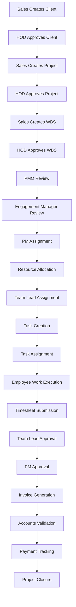
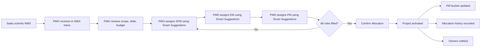
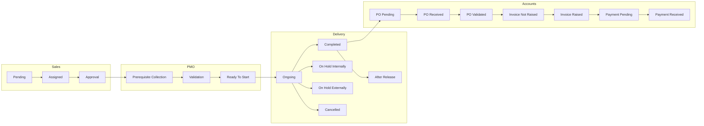
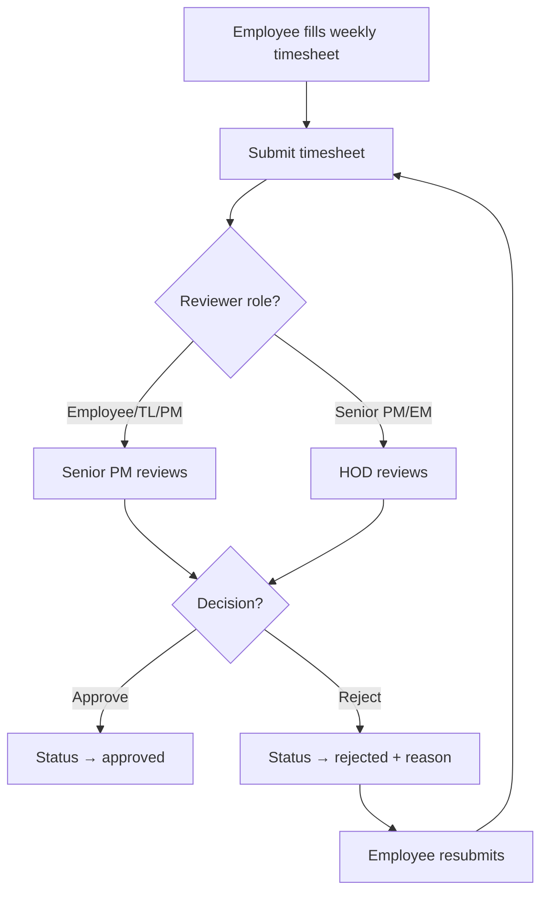
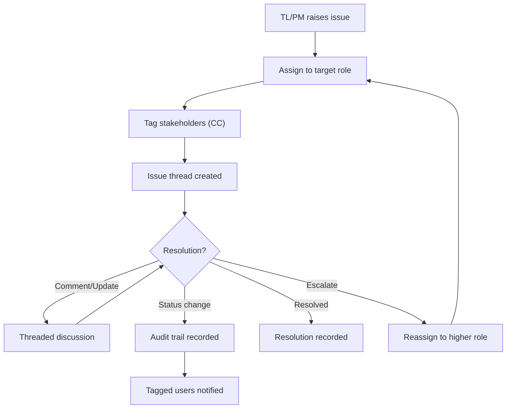

# Business Workflows

> **Last Updated:** 2026-06-16

---

## Master Workflow



---

## Workflow 1: Client Onboarding

**Actors:** Sales, HOD  
**Status:** 🔲 Backend required (currently clients are static mock data)

| Step | Actor | Action | System Response |
|------|-------|--------|----------------|
| 1 | Sales | Create new client | Client record created with `clientType: "NEW"` |
| 2 | HOD | Review client details | Validation of industry, contact info |
| 3 | HOD | Approve client | Client becomes active, visible to assigned roles |
| 4 | System | Assign to managers | Update `assignments` record |

---

## Workflow 2: Project Creation

**Actors:** Sales, HOD, Dhanshree  
**Status:** ⚠️ Dhanshree can create projects via `projects.new.tsx`

| Step | Actor | Action | System Response |
|------|-------|--------|----------------|
| 1 | Sales/Dhanshree | Create project under client | Project record with budget, timeline, scope |
| 2 | HOD | Review and approve | Project status → `ongoing` |
| 3 | System | Initialize WBS structure | Default WBS phases created |
| 4 | System | Create project stages | Sales → PMO → Delivery → Accounts tracker |

---

## Workflow 3: WBS Allocation

**Actors:** Sales, PMO  
**Status:** ✅ Implemented in `wbs-allocation.tsx`



**Smart Suggestion Algorithm** (from `fitScore()` in `wbs-allocation.tsx`):
```
fitScore = skillScore (60% weight) + utilizationScore (40% weight) + benchBoost (15%)

skillScore = (matchedSkills / requiredSkills) × 60
utilizationScore = max(0, 40 - (utilization - 60) × 0.8)
benchBoost = 15 if person is on bench, else 0
```

**WBS Status Flow:**
```
new → under_allocation → assigned → active → closed
```

---

## Workflow 4: Prerequisite Collection & Validation

**Actors:** PMO, Dhanshree  
**Status:** ✅ Implemented in project detail WBS tab

| Step | Actor | Action | System Response |
|------|-------|--------|----------------|
| 1 | PMO | Initiate prerequisite collection | Per-service collection status tracking |
| 2 | PMO | Collect documents per service | `collectionStatus: "Collected"` |
| 3 | PMO | Validate each service | `validationStatus: "Validated"` |
| 4 | PMO | Assign PM and SPM | `assignedPmIds`, `assignedSpmIds` |
| 5 | PM/SPM | Acknowledge assignment | `acknowledgedByPmIds`, `acknowledgedBySpmIds` |
| 6 | System | Check readiness | If all collected + validated + PM + SPM → `isProjectReadyToStart: true` |

**Service Prerequisite States:**
- Collection: `Pending To Collect` → `Collected`
- Validation: `Pending To Validate` → `Validated`

---

## Workflow 5: Project Stage Tracking

**Actors:** Dhanshree, Sales, PMO, Delivery, Accounts  
**Status:** ✅ Implemented via `StageTracker` component



---

## Workflow 6: Timesheet Submission & Approval

**Actors:** Employee, TL, PM, SPM, HOD  
**Status:** ✅ Implemented in `approvals.tsx` and `timesheet.tsx`



**Timesheet Data Model:**
- Weekly entries (Mon–Sun) per project/task
- Cell-level comments with comment threads
- History tracking with status transitions

---

## Workflow 7: Issue Escalation

**Actors:** TL, PM, SPM, EM, PMO, HOD  
**Status:** ✅ Implemented in `health.tsx`



**Escalation Chain:** TL → PM → Senior PM / EM → PMO / HOD

---

## Workflow 8: Invoice & Payment Tracking

**Actors:** Dhanshree, Accounts  
**Status:** ✅ Implemented in project detail Invoices tab

| Step | Actor | Action | System Response |
|------|-------|--------|----------------|
| 1 | System | Generate invoice schedule from WBS | Milestones with target dates |
| 2 | Dhanshree | Raise invoice (enter invoice number) | `invoiceStatus: "Raised"` |
| 3 | Accounts | Track payment | `paymentStatus: "Received"` with date |
| 4 | System | Update project stage | Accounts stage progression |

---

## Workflow 9: Resource Onboarding/Offboarding

**Actors:** HR, Dhanshree  
**Status:** ✅ Implemented in `dh-resources.tsx`

**Onboarding:**
- Track new hires with department, designation, joining date
- Assign to projects
- Status: `Probation` → `Active`

**Offboarding:**
- Track resignation date, last working date
- Resignation status: `Pending` → `Accepted` or `Retain`
- Track impacted projects for knowledge transfer

---

## Related Documents

- [[09_Client_Management]]
- [[10_Project_Management]]
- [[11_WBS_Management]]
- [[14_Timesheet_Management]]
- [[15_Approval_Engine]]
- [[17_Health_and_Governance]]
- [[18_Finance_Module]]
