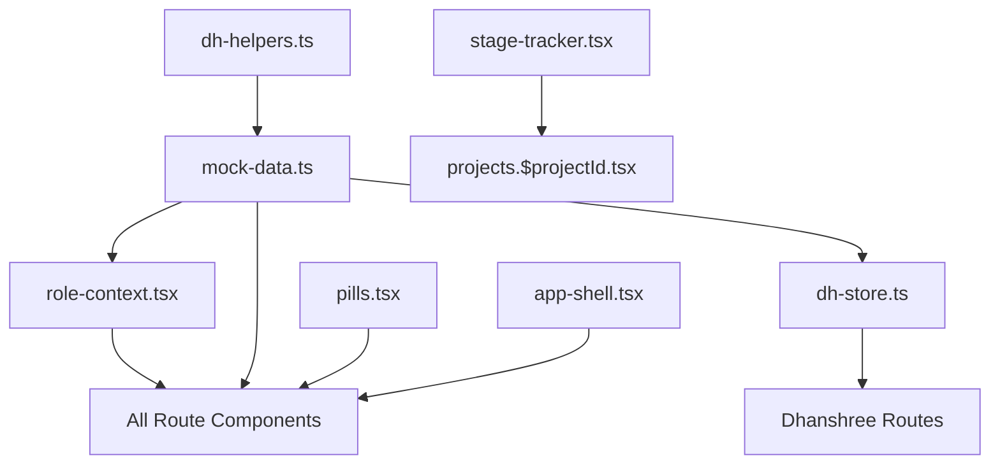

# Module Analysis

> **Last Updated:** 2026-06-16

---

## Module Registry

| # | Module | Route File | Lines | Size | Complexity |
|---|--------|-----------|-------|------|------------|
| 1 | Dashboard | `index.tsx` | 273 | 14KB | Medium |
| 2 | Client List | `clients.index.tsx` | ~200 | 6KB | Low |
| 3 | Client Detail | `clients.$clientId.tsx` | ~200 | 6KB | Low |
| 4 | Project List | `projects.index.tsx` | ~800 | 38KB | High |
| 5 | New Project | `projects.new.tsx` | ~1200 | 58KB | Very High |
| 6 | Project Detail | `projects.$projectId.tsx` | 3193 | 168KB | **Critical** |
| 7 | Portfolio | `portfolio.tsx` | ~300 | 7KB | Medium |
| 8 | WBS Allocation | `wbs-allocation.tsx` | 719 | 35KB | High |
| 9 | Health & Governance | `health.tsx` | 520 | 23KB | High |
| 10 | Approvals | `approvals.tsx` | 247 | 11KB | Medium |
| 11 | Reports | `reports.tsx` | ~500 | 20KB | Medium |
| 12 | Resources | `resources.tsx` | ~200 | 6KB | Low |
| 13 | Timesheet | `timesheet.tsx` | ~250 | 7KB | Medium |
| 14 | Allocation | `allocation.tsx` | ~350 | 11KB | Medium |
| 15 | Action Centre | `action-centre.tsx` | ~2000 | 83KB | **Critical** |
| 16 | Customers | `customers.tsx` | ~500 | 17KB | Medium |
| 17 | Customer Detail | `customers.$clientId.tsx` | ~600 | 23KB | High |
| 18 | DH Reports | `dh-reports.tsx` | ~500 | 16KB | Medium |
| 19 | DH Resources | `dh-resources.tsx` | ~800 | 31KB | High |

---

## Critical Modules (Require Careful Backend Migration)

### 1. Project Detail (`projects.$projectId.tsx`) — 3193 lines
**Tabs:** Overview, WBS, Tasks, Team, Health, Invoices
- Contains ~15 sub-components inline
- Role-conditional rendering (Dhanshree vs standard)
- WBS prerequisite management
- Invoice raise/cancel with modal
- Extension request with approver tagging
- Shadow team management
- Task assignment with drag-style interaction

**Backend migration priority:** HIGH — this file encapsulates most business logic

### 2. Action Centre (`action-centre.tsx`) — 83KB
**Sub-modules:** Issues, Alerts, Escalations, Appreciations, Interviews, Additional Requirements, Central Approvals, Timesheets
- Central hub for Dhanshree role
- Each sub-module has CRUD operations
- Complex comment/history tracking
- This is effectively 8 modules in one file

**Backend migration priority:** CRITICAL — should be split into separate API endpoints

### 3. DH Store (`dh-store.ts`) — 80KB
- Singleton state store with 20+ entity types
- All business logic for Dhanshree workflows
- Must be decomposed into backend services
- Contains seeded/mock data that must become database records

---

## Module Dependencies

---

## Related Documents

- [[09_Client_Management]] through [[19_Reports_and_Analytics]]
- [[29_Known_Frontend_Behavior]]
