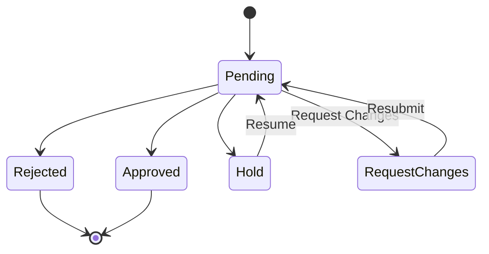

# Approval Engine

> **Status:** Frontend mock implementation  
> **Route:** `approvals.tsx`, Action Centre approvals tab  
> **Last Updated:** 2026-06-16

---

## Responsibilities
- Multi-level approval workflow orchestration
- Timesheet approval/rejection with audit trail
- Central approval requests (WBS, Budget, Assignment, Ready-to-Start, Resource, Timeline)
- Role-based approval routing
- History and comment tracking per approval

## Approval Types

### 1. Timesheet Approvals
See [[14_Timesheet_Management]] for detailed flow.

### 2. Central Approvals (Dhanshree Store)

```typescript
interface DhCentralApproval {
  id: string;                    // "APP-001"
  projectId: string;
  projectName: string;
  requestType: 
    | "WBS Approval"
    | "Budget Approval"
    | "PM Assignment Approval"
    | "SPM Assignment Approval"
    | "Project Ready To Start Approval"
    | "Resource Allocation Approval"
    | "Client Requirement Approval"
    | "Timeline Extension Approval";
  requestedBy: string;
  requestedById: string;
  requestedDate: string;
  status: "Pending" | "Approved" | "Rejected" | "Hold" | "Request Changes";
  description: string;
  comments: DhComment[];
  history: { status, at, updatedBy, comment }[];
  acknowledgedAt?: string;
}
```

### Current Central Approvals (5 entries)
| ID | Project | Type | Requested By | Status |
|----|---------|------|-------------|--------|
| APP-001 | Core Banking | WBS Approval | Aarav Mehta | Pending |
| APP-002 | Core Banking | Budget Approval | Vikram Shah | Pending |
| APP-003 | Clinical Data | Resource Allocation | Sana Iyer | Pending |
| APP-004 | Mobile Banking | Project Ready To Start | Vikram Shah | Pending |
| APP-005 | Core Banking | PM Assignment | Riya Kapoor | Pending |

## Approval Status Flow



## Business Rules
1. Every approval request has a requestor, approver chain, and status
2. Status changes are recorded in history with timestamp, updater, and comment
3. Comments are threaded (DhComment array)
4. Acknowledgment tracking via `acknowledgedAt`
5. PMO has monitoring-only access to timesheet approvals
6. HOD approves SPM/EM timesheets; SPM/EM approve PM timesheets
7. Central approvals are managed through Action Centre (Dhanshree)

## Future Backend Considerations
- Workflow engine with configurable approval chains
- SLA tracking (approval must happen within X hours)
- Auto-escalation for overdue approvals
- Email/push notifications on approval requests
- Delegation and proxy approval support
- Bulk approval for batch processing
- Approval templates for common request types
- Digital signatures for compliance

---

## Related Documents
- [[14_Timesheet_Management]]
- [[05_Business_Workflows]]
- [[16_Notification_System]]
