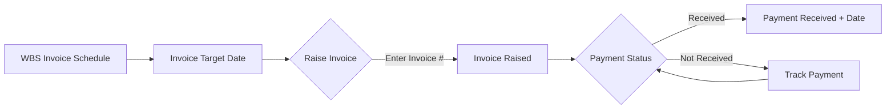

# Finance Module

> **Source:** Project detail Invoices tab, `mock-data.ts` → `invoices[]`, `dh-store.ts` → `DhInvoice[]`  
> **Last Updated:** 2026-06-16

---

## Responsibilities
- Invoice lifecycle management (schedule → raise → payment)
- PO (Purchase Order) tracking
- Payment status tracking
- Budget monitoring and burn rate calculation
- Financial reporting across portfolio

## Data Models

### Standard Invoice (mock-data.ts)
```typescript
{ projectId, unitPrice, qty, currency, invoiceAmount, 
  status: "raised"|"pending"|"paid"|"overdue",
  paymentStatus: "not_initiated"|"pending"|"completed"|"overdue",
  raisedOn, paymentReceivedDate? }
```

### Enhanced Invoice (Dhanshree Store)
```typescript
interface DhInvoice {
  id: string;
  projectId: string;
  milestone: string;
  invoiceTargetDate: string;
  unitPrice: number;
  qty: number;
  currency: string;
  invoiceAmount: number;
  invoiceStatus: "Not Raised" | "Raised";
  invoiceNumber: string;
  paymentStatus: "Not Received" | "Received";
  paymentReceivedDate: string;
  raisedBy?: string;
  raisedDate?: string;
}
```

### Accounts Detail
```typescript
interface AccountsDetail {
  poStatus: "PO Pending" | "PO Received" | "PO Validated";
  paymentStatus: "Payment Pending" | "Payment Received";
}
```

## Current Invoice Data (18 entries across 14 projects)

Total invoice value: ~$4.34M across all projects

| Status | Count | Description |
|--------|-------|-------------|
| Paid | 6 | Payment completed |
| Raised | 6 | Invoice sent, awaiting payment |
| Pending | 4 | Invoice in processing |
| Overdue | 1 | Payment past due date |

## Invoice Workflow



## WBS Billing Information
```typescript
interface WBSDetails {
  contractType: string;    // "Fixed Price"
  currency: string;        // "USD"
  accounts: {
    poStatus: string;
    poNumber?: string;
    billingModel: string;  // "70% Advance + 30% on Delivery"
    paymentTerms: string;
    invoices: WbsInvoice[];
  };
  services: WbsService[];  // With unitPrice and total per service
}
```

## Business Rules
1. Invoices are project-scoped (one project can have multiple invoices)
2. Invoice must have a number before being raised (modal enforces this)
3. Payment status can only be changed after invoice is raised
4. Tax is calculated at 18% on service totals
5. Dashboard shows invoice aggregates for PMO/BO roles
6. Overdue invoices trigger red indicators on dashboard

## Future Backend Considerations
- Invoice generation from WBS milestones
- Automated payment reminders
- Multi-currency support with exchange rates
- Tax calculation engine (GST, VAT, etc.)
- Integration with accounting systems (QuickBooks, SAP)
- Revenue recognition and forecasting
- Client payment history and credit scoring
- Dunning management for overdue invoices

---

## Related Documents
- [[10_Project_Management]]
- [[11_WBS_Management]]
- [[19_Reports_and_Analytics]]
