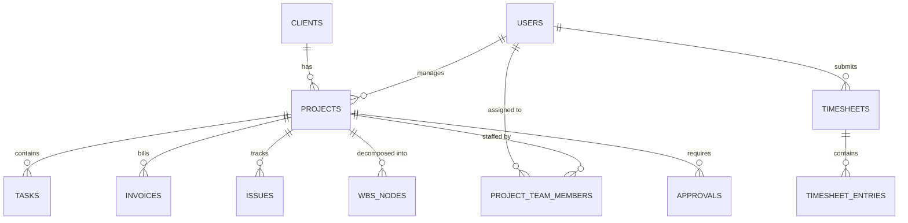

# Database Design Draft

> **Status:** 🔲 Not yet implemented — design proposal  
> **Target:** PostgreSQL  
> **Last Updated:** 2026-06-16

---

## Design Principles
1. Normalized schema (3NF) for transactional data
2. UUID primary keys for distributed safety
3. Soft deletes with `deleted_at` timestamps
4. Audit columns on all tables (`created_at`, `updated_at`, `created_by`, `updated_by`)
5. JSONB for flexible metadata where appropriate
6. PostgreSQL-native features: ENUM types, array columns, full-text search

---

## Core Tables

### users
```sql
CREATE TABLE users (
  id UUID PRIMARY KEY DEFAULT gen_random_uuid(),
  email VARCHAR(255) UNIQUE NOT NULL,
  name VARCHAR(255) NOT NULL,
  role VARCHAR(50) NOT NULL,
  department VARCHAR(100),
  sub_department VARCHAR(100),
  avatar VARCHAR(10),
  employee_id VARCHAR(20) UNIQUE,
  is_active BOOLEAN DEFAULT TRUE,
  created_at TIMESTAMPTZ DEFAULT NOW(),
  updated_at TIMESTAMPTZ DEFAULT NOW()
);
```

### clients
```sql
CREATE TABLE clients (
  id UUID PRIMARY KEY DEFAULT gen_random_uuid(),
  name VARCHAR(255) NOT NULL,
  industry VARCHAR(100) NOT NULL,
  logo VARCHAR(10),
  contact_email VARCHAR(255),
  client_type VARCHAR(10) DEFAULT 'NEW', -- 'NEW' or 'OLD'
  status VARCHAR(20) DEFAULT 'active',
  created_at TIMESTAMPTZ DEFAULT NOW(),
  updated_at TIMESTAMPTZ DEFAULT NOW(),
  deleted_at TIMESTAMPTZ
);
```

### projects
```sql
CREATE TABLE projects (
  id UUID PRIMARY KEY DEFAULT gen_random_uuid(),
  name VARCHAR(255) NOT NULL,
  client_id UUID REFERENCES clients(id),
  status VARCHAR(20) NOT NULL DEFAULT 'ongoing',
  health VARCHAR(10) NOT NULL DEFAULT 'green',
  progress INTEGER DEFAULT 0 CHECK (progress >= 0 AND progress <= 100),
  pm_id UUID REFERENCES users(id),
  tl_id UUID REFERENCES users(id),
  start_date DATE NOT NULL,
  end_date DATE NOT NULL,
  budget DECIMAL(15,2),
  spent DECIMAL(15,2) DEFAULT 0,
  description TEXT,
  contract_type VARCHAR(50),
  project_type VARCHAR(50),
  currency VARCHAR(10) DEFAULT 'USD',
  created_at TIMESTAMPTZ DEFAULT NOW(),
  updated_at TIMESTAMPTZ DEFAULT NOW(),
  deleted_at TIMESTAMPTZ
);
```

### project_team_members
```sql
CREATE TABLE project_team_members (
  id UUID PRIMARY KEY DEFAULT gen_random_uuid(),
  project_id UUID REFERENCES projects(id),
  user_id UUID REFERENCES users(id),
  team_type VARCHAR(20) DEFAULT 'primary', -- 'primary' or 'shadow'
  billability VARCHAR(20) DEFAULT 'Billable',
  resource_type VARCHAR(20) DEFAULT 'Fixed',
  start_date DATE,
  end_date DATE,
  UNIQUE(project_id, user_id)
);
```

### wbs_nodes
```sql
CREATE TABLE wbs_nodes (
  id UUID PRIMARY KEY DEFAULT gen_random_uuid(),
  project_id UUID REFERENCES projects(id),
  parent_id UUID REFERENCES wbs_nodes(id),
  name VARCHAR(255) NOT NULL,
  progress INTEGER DEFAULT 0,
  sort_order INTEGER DEFAULT 0
);
```

### tasks
```sql
CREATE TABLE tasks (
  id UUID PRIMARY KEY DEFAULT gen_random_uuid(),
  project_id UUID REFERENCES projects(id),
  wbs_node_id UUID REFERENCES wbs_nodes(id),
  title VARCHAR(255) NOT NULL,
  status VARCHAR(20) NOT NULL DEFAULT 'todo',
  assignee_id UUID REFERENCES users(id),
  due_date DATE,
  progress INTEGER DEFAULT 0,
  est_hours DECIMAL(8,2),
  actual_hours DECIMAL(8,2),
  created_at TIMESTAMPTZ DEFAULT NOW(),
  updated_at TIMESTAMPTZ DEFAULT NOW()
);
```

### timesheets
```sql
CREATE TABLE timesheets (
  id UUID PRIMARY KEY DEFAULT gen_random_uuid(),
  user_id UUID REFERENCES users(id),
  week_start DATE NOT NULL,
  status VARCHAR(20) NOT NULL DEFAULT 'draft',
  total_hours DECIMAL(8,2),
  submitted_at TIMESTAMPTZ,
  rejection_reason TEXT,
  created_at TIMESTAMPTZ DEFAULT NOW(),
  updated_at TIMESTAMPTZ DEFAULT NOW()
);
```

### timesheet_entries
```sql
CREATE TABLE timesheet_entries (
  id UUID PRIMARY KEY DEFAULT gen_random_uuid(),
  timesheet_id UUID REFERENCES timesheets(id),
  project_id UUID REFERENCES projects(id),
  task_id UUID REFERENCES tasks(id),
  hours DECIMAL(4,2)[] NOT NULL, -- Array of 7 (Mon-Sun)
  note TEXT
);
```

### issues
```sql
CREATE TABLE issues (
  id UUID PRIMARY KEY DEFAULT gen_random_uuid(),
  client_id UUID REFERENCES clients(id),
  project_id UUID REFERENCES projects(id),
  type VARCHAR(30) NOT NULL,
  description TEXT NOT NULL,
  priority VARCHAR(20) NOT NULL,
  status VARCHAR(20) NOT NULL DEFAULT 'open',
  raised_by_id UUID REFERENCES users(id),
  assigned_to_id UUID REFERENCES users(id),
  resolution TEXT,
  created_at TIMESTAMPTZ DEFAULT NOW(),
  updated_at TIMESTAMPTZ DEFAULT NOW()
);
```

### invoices
```sql
CREATE TABLE invoices (
  id UUID PRIMARY KEY DEFAULT gen_random_uuid(),
  project_id UUID REFERENCES projects(id),
  milestone VARCHAR(255),
  target_date DATE,
  unit_price DECIMAL(15,2),
  qty INTEGER,
  currency VARCHAR(10),
  amount DECIMAL(15,2),
  invoice_number VARCHAR(50),
  invoice_status VARCHAR(20) DEFAULT 'Not Raised',
  payment_status VARCHAR(20) DEFAULT 'Not Received',
  payment_received_date DATE,
  raised_by UUID REFERENCES users(id),
  raised_at TIMESTAMPTZ,
  created_at TIMESTAMPTZ DEFAULT NOW(),
  updated_at TIMESTAMPTZ DEFAULT NOW()
);
```

### approvals
```sql
CREATE TABLE approvals (
  id UUID PRIMARY KEY DEFAULT gen_random_uuid(),
  project_id UUID REFERENCES projects(id),
  request_type VARCHAR(50) NOT NULL,
  requested_by UUID REFERENCES users(id),
  status VARCHAR(20) NOT NULL DEFAULT 'Pending',
  description TEXT,
  acknowledged_at TIMESTAMPTZ,
  created_at TIMESTAMPTZ DEFAULT NOW(),
  updated_at TIMESTAMPTZ DEFAULT NOW()
);
```

### audit_log
```sql
CREATE TABLE audit_log (
  id UUID PRIMARY KEY DEFAULT gen_random_uuid(),
  entity_type VARCHAR(50) NOT NULL,
  entity_id UUID NOT NULL,
  actor_id UUID REFERENCES users(id),
  action VARCHAR(255) NOT NULL,
  details JSONB,
  created_at TIMESTAMPTZ DEFAULT NOW()
);
CREATE INDEX idx_audit_entity ON audit_log(entity_type, entity_id);
CREATE INDEX idx_audit_actor ON audit_log(actor_id);
```

---

## Entity Relationship Overview



---

## Related Documents
- [[21_API_Design_Draft]]
- [[22_Backend_Architecture_Draft]]
