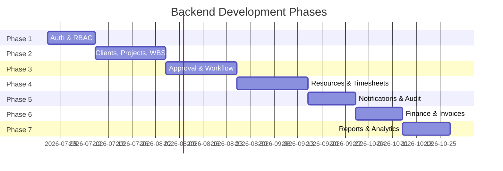

# Backend Development Phases

> **Date:** 2026-06-16  
> **Estimated Total Duration:** 16-20 weeks  
> **Stack:** FastAPI + PostgreSQL + SQLAlchemy + Alembic

---

## Phase 1: Authentication & RBAC (Weeks 1-2)

### Objectives
- Establish JWT-based authentication system
- Implement RBAC middleware with permission guards
- Create user management with password hashing
- Seed initial users from `mock-data.ts` people array
- Replace frontend role switcher with login flow

### Dependencies
- PostgreSQL database running (local or Docker)
- Python environment with FastAPI installed

### Database Changes
```sql
-- users table
CREATE TABLE users (
  id UUID PRIMARY KEY DEFAULT gen_random_uuid(),
  email VARCHAR(255) UNIQUE NOT NULL,
  password_hash VARCHAR(255) NOT NULL,
  name VARCHAR(255) NOT NULL,
  role VARCHAR(50) NOT NULL,
  avatar VARCHAR(10),
  employee_id VARCHAR(20) UNIQUE,
  is_active BOOLEAN DEFAULT TRUE,
  created_at TIMESTAMPTZ DEFAULT NOW(),
  updated_at TIMESTAMPTZ DEFAULT NOW()
);

-- roles table
CREATE TABLE roles (
  id UUID PRIMARY KEY DEFAULT gen_random_uuid(),
  name VARCHAR(50) UNIQUE NOT NULL,
  display_name VARCHAR(100) NOT NULL,
  permissions JSONB NOT NULL DEFAULT '[]'
);

-- refresh tokens
CREATE TABLE refresh_tokens (
  id UUID PRIMARY KEY,
  user_id UUID REFERENCES users(id),
  token_hash VARCHAR(255) NOT NULL,
  expires_at TIMESTAMPTZ NOT NULL,
  created_at TIMESTAMPTZ DEFAULT NOW()
);
```

### API Requirements
| Method | Endpoint | Description |
|--------|----------|-------------|
| POST | `/api/v1/auth/login` | Email + password → JWT tokens |
| POST | `/api/v1/auth/refresh` | Refresh token → new access token |
| POST | `/api/v1/auth/logout` | Invalidate refresh token |
| GET | `/api/v1/auth/me` | Current user profile |
| GET | `/api/v1/users` | List users (admin) |
| GET | `/api/v1/users/{id}` | User detail |
| PUT | `/api/v1/users/{id}` | Update user |

### Testing Strategy
- Unit tests for JWT creation/verification
- Integration tests for login/refresh/logout flow
- Permission guard tests (authorized vs unauthorized)
- Password hashing verification

### Estimated Complexity: 🟡 Medium
- Well-documented patterns available
- FastAPI has excellent auth examples
- Most complex part: mapping existing 6 roles to permission sets

### Frontend Integration
- Replace `role-context.tsx` role switcher with login form
- Store JWT in httpOnly cookie or localStorage
- Add `Authorization: Bearer` header to all API calls
- Redirect to `/login` when 401 received

---

## Phase 2: Clients, Projects & WBS (Weeks 3-5)

### Objectives
- CRUD APIs for clients, projects, and WBS
- Role-based data scoping (SPM sees 3 clients, PMO sees all)
- Project detail with WBS tree structure
- WBS allocation workflow with smart suggestions
- Seed all mock data into database

### Dependencies
- Phase 1 complete (auth + RBAC)

### Database Changes
```sql
-- clients, projects, project_team_members, wbs_nodes, tasks,
-- wbs_requests, wbs_allocation_slots
-- (See 20_Database_Design_Draft.md for complete schemas)

-- Role assignments (which roles see which clients)
CREATE TABLE role_assignments (
  id UUID PRIMARY KEY,
  role_id UUID REFERENCES roles(id),
  client_id UUID REFERENCES clients(id),
  UNIQUE(role_id, client_id)
);
```

### API Requirements
| Method | Endpoint | Count |
|--------|----------|-------|
| Clients | `/api/v1/clients` CRUD + projects | 5 endpoints |
| Projects | `/api/v1/projects` CRUD + tasks/team/WBS/stages | 12 endpoints |
| Tasks | `/api/v1/tasks` CRUD + assign | 4 endpoints |
| WBS Allocation | `/api/v1/wbs-requests` CRUD + allocate/activate | 5 endpoints |

### Testing Strategy
- CRUD tests for each entity
- Data scoping tests (verify SPM can't see PMO's clients)
- WBS allocation workflow end-to-end test
- Smart suggestion algorithm unit tests (port `fitScore()`)

### Estimated Complexity: 🔴 High
- 43 projects, 10 clients to seed
- WBS allocation has complex business logic
- Smart suggestion algorithm must be ported from TypeScript
- Project detail has 6 tabs each needing separate data endpoints

### Frontend Integration
- Replace `import { clients, projects } from "@/lib/mock-data"` with React Query hooks
- Pattern: `useQuery({ queryKey: ["clients"], queryFn: fetchClients })`

---

## Phase 3: Approval & Workflow Engine (Weeks 6-8)

### Objectives
- Centralized approval workflow (WBS, Budget, Assignment, etc.)
- Configurable approval chains per request type
- Issue management with threaded comments
- Escalation tracking with audit trails
- Status transition validation

### Dependencies
- Phase 2 complete (projects + clients)

### Database Changes
```sql
CREATE TABLE approvals (
  id UUID PRIMARY KEY,
  project_id UUID REFERENCES projects(id),
  request_type VARCHAR(50) NOT NULL,
  requested_by UUID REFERENCES users(id),
  status VARCHAR(20) DEFAULT 'Pending',
  description TEXT,
  acknowledged_at TIMESTAMPTZ,
  created_at TIMESTAMPTZ DEFAULT NOW(),
  updated_at TIMESTAMPTZ DEFAULT NOW()
);

CREATE TABLE approval_comments (
  id UUID PRIMARY KEY,
  approval_id UUID REFERENCES approvals(id),
  author_id UUID REFERENCES users(id),
  text TEXT NOT NULL,
  created_at TIMESTAMPTZ DEFAULT NOW()
);

CREATE TABLE approval_history (
  id UUID PRIMARY KEY,
  approval_id UUID REFERENCES approvals(id),
  status VARCHAR(20),
  updated_by UUID REFERENCES users(id),
  comment TEXT,
  created_at TIMESTAMPTZ DEFAULT NOW()
);

CREATE TABLE issues (
  id UUID PRIMARY KEY,
  client_id UUID REFERENCES clients(id),
  project_id UUID REFERENCES projects(id),
  type VARCHAR(30) NOT NULL,
  description TEXT NOT NULL,
  priority VARCHAR(20) NOT NULL,
  status VARCHAR(20) DEFAULT 'open',
  raised_by_id UUID REFERENCES users(id),
  assigned_to_id UUID REFERENCES users(id),
  resolution TEXT,
  created_at TIMESTAMPTZ DEFAULT NOW(),
  updated_at TIMESTAMPTZ DEFAULT NOW()
);

CREATE TABLE issue_comments (...);
CREATE TABLE issue_tags (...);
CREATE TABLE issue_audit (...);
```

### API Requirements
| Module | Endpoints | Notes |
|--------|-----------|-------|
| Approvals | 5 | CRUD + status update + comments |
| Issues | 6 | CRUD + comments + tags + status |
| Escalations | 4 | CRUD + status tracking |

### Testing Strategy
- Approval state machine tests (valid/invalid transitions)
- Permission-based approval routing tests
- Issue escalation chain tests
- Comment threading tests
- Audit trail verification

### Estimated Complexity: 🔴 High
- Most complex business logic
- State machines with validation
- Configurable approval chains require careful design

---

## Phase 4: Resource Allocation & Timesheets (Weeks 9-11)

### Objectives
- Resource workload tracking and utilization calculation
- PM bucket management (capacity tracking)
- Bench resource tracking
- Weekly timesheet submission with daily hour grid
- Multi-level timesheet approval workflow
- Cell-level comments on timesheet entries

### Dependencies
- Phase 3 complete (approval engine for timesheet approvals)

### Database Changes
```sql
CREATE TABLE timesheets (
  id UUID PRIMARY KEY,
  user_id UUID REFERENCES users(id),
  week_start DATE NOT NULL,
  status VARCHAR(20) DEFAULT 'draft',
  total_hours DECIMAL(8,2),
  submitted_at TIMESTAMPTZ,
  rejection_reason TEXT,
  created_at TIMESTAMPTZ DEFAULT NOW()
);

CREATE TABLE timesheet_entries (
  id UUID PRIMARY KEY,
  timesheet_id UUID REFERENCES timesheets(id),
  project_id UUID REFERENCES projects(id),
  task_id UUID REFERENCES tasks(id),
  hours DECIMAL(4,2)[] NOT NULL,  -- Array[7] Mon-Sun
  note TEXT
);

CREATE TABLE timesheet_cell_comments (...);
CREATE TABLE pm_buckets (...);
CREATE TABLE resource_workload (...);

-- Onboarding/offboarding
CREATE TABLE onboarded_resources (...);
CREATE TABLE offboarding_resources (...);
```

### API Requirements
| Module | Endpoints | Notes |
|--------|-----------|-------|
| Timesheets | 7 | CRUD + submit + approve + reject |
| Resources | 6 | workload + bench + onboarding + offboarding |
| PM Buckets | 3 | list + capacity + allocation |

### Testing Strategy
- Timesheet submission/approval flow end-to-end
- Multi-level approval routing verification
- Rejection with reason validation
- Utilization calculation accuracy tests
- Cell comment threading tests

### Estimated Complexity: 🟡 Medium
- Timesheet grid is complex on frontend, simpler on backend
- Approval routing reuses Phase 3 engine
- Utilization calculation is straightforward

---

## Phase 5: Notifications & Audit Logs (Weeks 12-13)

### Objectives
- In-app notification system with read/unread tracking
- Email notification delivery for critical events
- Centralized audit logging for all state changes
- User notification preferences
- Real-time notification count in header

### Dependencies
- Phase 4 complete (all entities that generate notifications)

### Database Changes
```sql
CREATE TABLE notifications (
  id UUID PRIMARY KEY,
  user_id UUID REFERENCES users(id),
  type VARCHAR(50) NOT NULL,
  title TEXT NOT NULL,
  body TEXT,
  data JSONB,
  read BOOLEAN DEFAULT FALSE,
  created_at TIMESTAMPTZ DEFAULT NOW()
);

CREATE TABLE notification_preferences (
  user_id UUID REFERENCES users(id),
  event_type VARCHAR(50),
  in_app BOOLEAN DEFAULT TRUE,
  email BOOLEAN DEFAULT TRUE,
  PRIMARY KEY (user_id, event_type)
);

CREATE TABLE audit_log (
  id UUID PRIMARY KEY,
  entity_type VARCHAR(50),
  entity_id UUID,
  actor_id UUID REFERENCES users(id),
  action VARCHAR(255),
  old_value JSONB,
  new_value JSONB,
  metadata JSONB,
  created_at TIMESTAMPTZ DEFAULT NOW()
);
CREATE INDEX idx_audit_entity ON audit_log(entity_type, entity_id);
```

### API Requirements
| Module | Endpoints | Notes |
|--------|-----------|-------|
| Notifications | 4 | list + read + read-all + preferences |
| Audit | 2 | list by entity + list by actor |

### Testing Strategy
- Notification generation on state changes
- Email delivery tests (with mock SMTP)
- Audit log completeness verification
- Read/unread tracking tests

### Estimated Complexity: 🟢 Low-Medium
- Event-driven pattern is well-established
- Audit logging is a cross-cutting concern (middleware)
- Email delivery is the main complexity

---

## Phase 6: Finance — Invoices & Payments (Weeks 14-15)

### Objectives
- Invoice lifecycle management
- PO tracking and validation
- Payment status tracking with dates
- Multi-currency support foundation
- Tax calculation (18% GST default)
- Financial dashboard aggregations

### Dependencies
- Phase 2 complete (projects)

### Database Changes
```sql
CREATE TABLE invoices (
  id UUID PRIMARY KEY,
  project_id UUID REFERENCES projects(id),
  milestone VARCHAR(255),
  target_date DATE,
  unit_price DECIMAL(15,2),
  qty INTEGER,
  currency VARCHAR(10) DEFAULT 'USD',
  amount DECIMAL(15,2),
  tax_percent DECIMAL(5,2) DEFAULT 18.0,
  tax_amount DECIMAL(15,2),
  total_amount DECIMAL(15,2),
  invoice_number VARCHAR(50),
  invoice_status VARCHAR(20) DEFAULT 'Not Raised',
  payment_status VARCHAR(20) DEFAULT 'Not Received',
  payment_received_date DATE,
  raised_by UUID REFERENCES users(id),
  raised_at TIMESTAMPTZ,
  created_at TIMESTAMPTZ DEFAULT NOW()
);

CREATE TABLE purchase_orders (
  id UUID PRIMARY KEY,
  project_id UUID REFERENCES projects(id),
  po_number VARCHAR(50),
  status VARCHAR(20) DEFAULT 'Pending',
  received_date DATE,
  validated_date DATE
);
```

### API Requirements
| Module | Endpoints | Notes |
|--------|-----------|-------|
| Invoices | 5 | CRUD + raise + payment update |
| Purchase Orders | 3 | CRUD + status |

### Estimated Complexity: 🟢 Low-Medium

---

## Phase 7: Reports & Analytics (Weeks 16-17)

### Objectives
- Aggregation endpoints for dashboard KPIs
- Project health distribution charts
- Resource utilization reports
- Financial summaries (revenue, outstanding, overdue)
- Export to PDF/Excel (future)

### Dependencies
- All previous phases (aggregates across all entities)

### Database Changes
- No new tables
- Materialized views for expensive aggregations:
```sql
CREATE MATERIALIZED VIEW project_health_summary AS
  SELECT health, COUNT(*) as count FROM projects WHERE deleted_at IS NULL GROUP BY health;

CREATE MATERIALIZED VIEW resource_utilization AS
  SELECT user_id, SUM(hours) as total_hours, COUNT(DISTINCT project_id) as projects
  FROM timesheet_entries te JOIN timesheets t ON te.timesheet_id = t.id
  WHERE t.status = 'approved' GROUP BY user_id;
```

### API Requirements
| Module | Endpoints | Notes |
|--------|-----------|-------|
| Reports | 6 | health-dist, utilization, revenue, project-status, issue-trends, KPIs |

### Estimated Complexity: 🟢 Low
- Query-only endpoints, no mutations
- Most complex part is efficient SQL aggregation

---

## Implementation Order Summary



---

## Related Documents

- [[Backend_Master_Plan]] — Architecture decisions
- [[20_Database_Design_Draft]] — Complete schema
- [[21_API_Design_Draft]] — Endpoint specifications
- [[28_Development_Roadmap]] — Overall project roadmap
