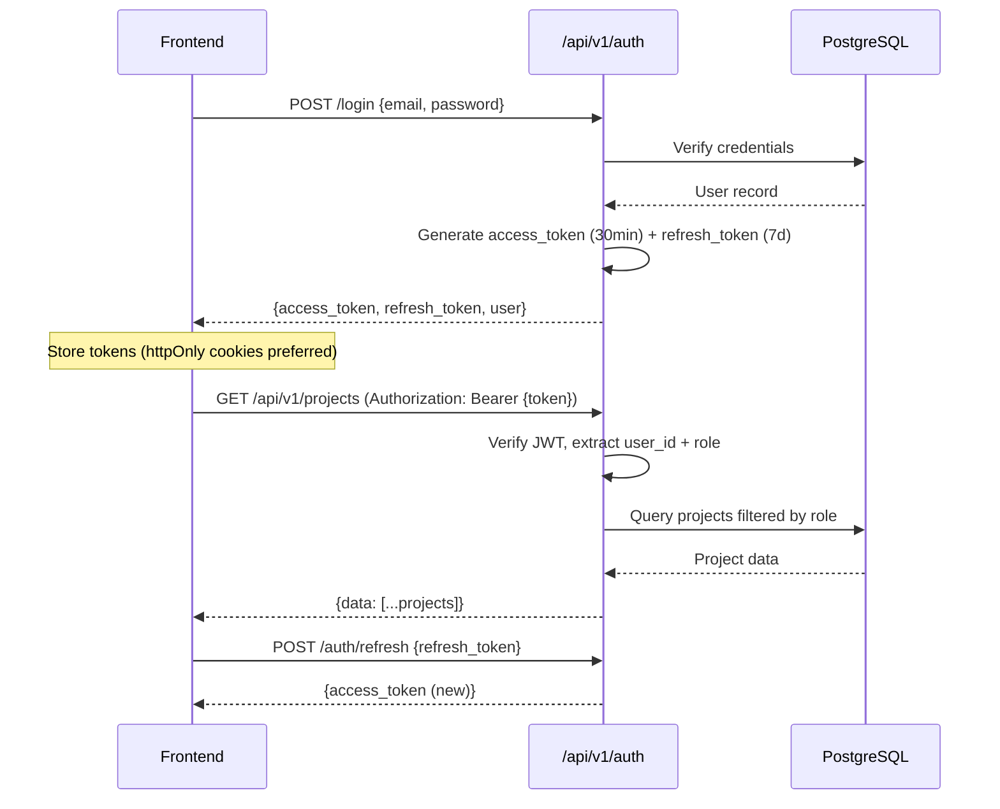

# Backend Master Plan

> **Status:** Design Phase  
> **Date:** 2026-06-16  
> **Target Stack:** FastAPI + PostgreSQL + SQLAlchemy + Alembic

---

## 1. Recommended Backend Stack

| Layer | Technology | Version | Rationale |
|-------|-----------|---------|-----------|
| **Framework** | FastAPI | 0.115+ | Async, auto-docs (OpenAPI), Pydantic validation, Python ecosystem |
| **Database** | PostgreSQL | 16+ | JSONB support, arrays, full-text search, enterprise-grade |
| **ORM** | SQLAlchemy | 2.0+ | Mature, async support, migration integration |
| **Migrations** | Alembic | 1.13+ | Auto-generate from model changes |
| **Auth** | python-jose + passlib | Latest | JWT creation/verification + password hashing |
| **Validation** | Pydantic v2 | 2.x | Request/response schemas, FastAPI native |
| **Task Queue** | Celery + Redis | Latest | Background jobs (emails, reports, notifications) |
| **Email** | FastAPI-Mail | Latest | SMTP-based notification delivery |
| **Testing** | pytest + httpx | Latest | Async test client for FastAPI |
| **Containerization** | Docker + docker-compose | Latest | Local dev + deployment consistency |

---

## 2. Authentication Strategy

### JWT-Based Authentication



### Token Structure
```json
{
  "sub": "user-uuid",
  "email": "user@company.com",
  "role": "senior_pm",
  "permissions": ["projects:read", "timesheets:approve"],
  "exp": 1719561600,
  "iat": 1719559800
}
```

---

## 3. Authorization Strategy (RBAC)

### Permission Model

```sql
-- Roles table
CREATE TABLE roles (
  id UUID PRIMARY KEY,
  name VARCHAR(50) UNIQUE NOT NULL,      -- 'senior_pm', 'pmo', etc.
  display_name VARCHAR(100) NOT NULL,    -- 'Senior Project Manager'
  permissions JSONB NOT NULL DEFAULT '[]' -- ['projects:read', 'timesheets:approve']
);

-- Users have one primary role
ALTER TABLE users ADD COLUMN role_id UUID REFERENCES roles(id);
```

### FastAPI Middleware Pattern
```python
from fastapi import Depends, HTTPException

def require_permission(permission: str):
    async def guard(current_user = Depends(get_current_user)):
        if permission not in current_user.permissions:
            raise HTTPException(403, "Insufficient permissions")
        return current_user
    return guard

@router.get("/wbs-requests")
async def list_wbs_requests(
    user = Depends(require_permission("wbs:allocate"))
):
    # Only PMO can access this
    ...
```

### Data Scoping
```python
async def get_visible_clients(user):
    if user.role in ("pmo", "hod", "business_owner", "dhanshree"):
        return await db.query(Client).all()
    
    # SPM/EM see only assigned clients
    assignments = await db.query(RoleAssignment).filter_by(user_id=user.id).all()
    return await db.query(Client).filter(Client.id.in_(assignment.client_ids)).all()
```

---

## 4. API Architecture

### URL Pattern
```
/api/v1/{resource}                  # Collection
/api/v1/{resource}/{id}             # Single resource
/api/v1/{resource}/{id}/{action}    # Resource action
/api/v1/{resource}/{id}/{sub}       # Sub-resource
```

### Response Format
```json
{
  "data": { ... },
  "meta": {
    "total": 100,
    "page": 1,
    "per_page": 20
  },
  "errors": null
}
```

### Error Response
```json
{
  "data": null,
  "meta": null,
  "errors": [
    {
      "code": "VALIDATION_ERROR",
      "field": "email",
      "message": "Email is required"
    }
  ]
}
```

---

## 5. Module Breakdown

### Module → API Endpoint Mapping

| Module | Base Path | Endpoints | Priority |
|--------|-----------|-----------|----------|
| **Auth** | `/api/v1/auth` | login, refresh, logout, me | Phase 1 |
| **Users** | `/api/v1/users` | CRUD, roles, permissions | Phase 1 |
| **Clients** | `/api/v1/clients` | CRUD, projects list | Phase 2 |
| **Projects** | `/api/v1/projects` | CRUD, tasks, team, WBS, stages, prerequisites | Phase 2 |
| **Tasks** | `/api/v1/tasks` | CRUD, assign, status | Phase 2 |
| **WBS** | `/api/v1/wbs-requests` | CRUD, allocate, activate | Phase 2 |
| **Timesheets** | `/api/v1/timesheets` | CRUD, submit, approve, reject | Phase 4 |
| **Issues** | `/api/v1/issues` | CRUD, comments, tags, status | Phase 3 |
| **Invoices** | `/api/v1/invoices` | CRUD, raise, payment | Phase 6 |
| **Approvals** | `/api/v1/approvals` | CRUD, status, comments | Phase 3 |
| **Resources** | `/api/v1/resources` | workload, bench, onboarding | Phase 4 |
| **Notifications** | `/api/v1/notifications` | list, read, preferences | Phase 5 |
| **Reports** | `/api/v1/reports` | aggregations, exports | Phase 7 |

---

## 6. Backend Folder Structure

```
apps/backend/
├── app/
│   ├── __init__.py
│   ├── main.py                       # FastAPI app instance, CORS, middleware
│   ├── config.py                     # Settings from env vars (Pydantic BaseSettings)
│   ├── database.py                   # SQLAlchemy engine, session factory
│   ├── dependencies.py               # Common dependencies (get_db, get_current_user)
│   │
│   ├── middleware/
│   │   ├── __init__.py
│   │   ├── auth.py                   # JWT verification middleware
│   │   ├── rbac.py                   # Permission checking
│   │   └── logging.py               # Request/response logging
│   │
│   ├── models/                       # SQLAlchemy ORM models
│   │   ├── __init__.py
│   │   ├── base.py                   # Base model with audit columns
│   │   ├── user.py
│   │   ├── client.py
│   │   ├── project.py
│   │   ├── task.py
│   │   ├── wbs.py
│   │   ├── timesheet.py
│   │   ├── issue.py
│   │   ├── invoice.py
│   │   ├── approval.py
│   │   ├── notification.py
│   │   └── audit.py
│   │
│   ├── schemas/                      # Pydantic request/response models
│   │   ├── __init__.py
│   │   ├── auth.py
│   │   ├── user.py
│   │   ├── client.py
│   │   ├── project.py
│   │   ├── task.py
│   │   ├── wbs.py
│   │   ├── timesheet.py
│   │   ├── issue.py
│   │   ├── invoice.py
│   │   ├── approval.py
│   │   └── common.py                # Pagination, error schemas
│   │
│   ├── routers/                      # API endpoint handlers
│   │   ├── __init__.py
│   │   ├── auth.py
│   │   ├── users.py
│   │   ├── clients.py
│   │   ├── projects.py
│   │   ├── tasks.py
│   │   ├── wbs.py
│   │   ├── timesheets.py
│   │   ├── issues.py
│   │   ├── invoices.py
│   │   ├── approvals.py
│   │   ├── resources.py
│   │   ├── notifications.py
│   │   └── reports.py
│   │
│   ├── services/                     # Business logic layer
│   │   ├── __init__.py
│   │   ├── auth_service.py
│   │   ├── approval_engine.py        # Workflow engine
│   │   ├── notification_service.py   # Multi-channel delivery
│   │   ├── allocation_engine.py      # Smart fit-score algorithm
│   │   ├── health_calculator.py      # Project health scoring
│   │   ├── audit_service.py          # Centralized audit logging
│   │   └── report_service.py         # Aggregation + export
│   │
│   └── utils/
│       ├── __init__.py
│       ├── security.py               # Password hashing, JWT
│       └── pagination.py             # Pagination utilities
│
├── alembic/
│   ├── env.py
│   ├── script.py.mako
│   └── versions/                     # Migration files
│
├── seeds/
│   ├── __init__.py
│   ├── seed_users.py                 # From mock-data people
│   ├── seed_clients.py               # From mock-data clients
│   ├── seed_projects.py              # From mock-data projects
│   └── seed_all.py                   # Run all seeds
│
├── tests/
│   ├── __init__.py
│   ├── conftest.py                   # Fixtures, test DB
│   ├── test_auth.py
│   ├── test_clients.py
│   ├── test_projects.py
│   └── ...
│
├── alembic.ini
├── requirements.txt
├── requirements-dev.txt
├── Dockerfile
├── docker-compose.yml
├── .env.example
└── README.md
```

---

## 7. Deployment Strategy

### Development
```yaml
# docker-compose.yml
services:
  db:
    image: postgres:16
    environment:
      POSTGRES_DB: compass
      POSTGRES_USER: compass
      POSTGRES_PASSWORD: compass_dev
    ports: ["5432:5432"]
    volumes: ["pgdata:/var/lib/postgresql/data"]
  
  api:
    build: ./apps/backend
    command: uvicorn app.main:app --reload --host 0.0.0.0 --port 8000
    ports: ["8000:8000"]
    depends_on: [db]
    environment:
      DATABASE_URL: postgresql+asyncpg://compass:compass_dev@db:5432/compass
      SECRET_KEY: dev-secret-key
```

### Production Options
1. **Cloudflare Workers** (frontend) + **Railway/Render** (backend + PostgreSQL)
2. **Vercel** (frontend) + **AWS ECS** (backend) + **RDS** (database)
3. **Docker Compose** on a single VPS for initial deployment

---

## 8. Security Considerations

| Measure | Implementation |
|---------|---------------|
| Password hashing | bcrypt via passlib |
| JWT token expiry | 30 min access, 7 day refresh |
| CORS | Restrict to frontend origin |
| Rate limiting | slowapi (per IP and per user) |
| Input validation | Pydantic schemas on every endpoint |
| SQL injection | SQLAlchemy ORM (parameterized queries) |
| XSS prevention | Response encoding, Content-Security-Policy |
| HTTPS | Enforce in production (SSL termination at LB) |
| Audit logging | Every state change logged to `audit_log` table |
| Secrets management | Environment variables, never in code |

---

## 9. Scalability Considerations

| Aspect | Strategy |
|--------|---------|
| Database scaling | Read replicas for reports, connection pooling (pgbouncer) |
| API scaling | Stateless design allows horizontal scaling |
| Background jobs | Celery workers scale independently |
| Caching | Redis for session data, query cache, rate limiting |
| File storage | S3/R2 for uploads, CDN for static assets |
| Real-time updates | WebSocket connections via FastAPI WebSocket support |

---

## Related Documents

- [[20_Database_Design_Draft]] — Complete PostgreSQL schema
- [[21_API_Design_Draft]] — Endpoint specifications
- [[22_Backend_Architecture_Draft]] — Architecture layers
- [[23_Security_and_RBAC]] — Security architecture
- [[BACKEND_DEVELOPMENT_PHASES]] — Implementation roadmap
