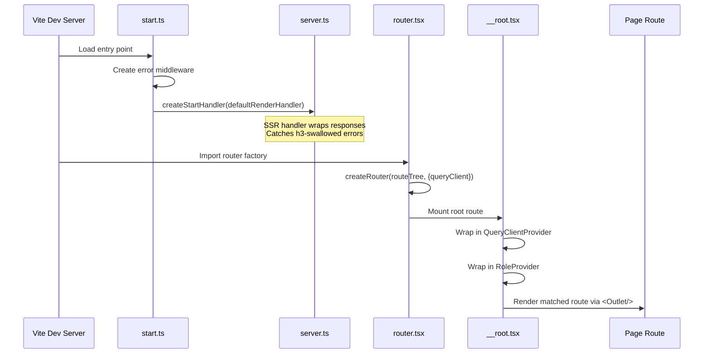
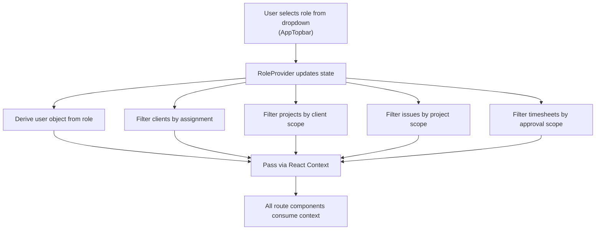
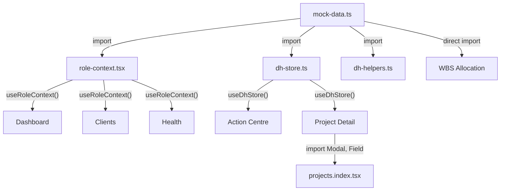

# Frontend Architecture

> **Audience:** New developer who has never seen this codebase  
> **Date:** 2026-06-16  
> **Prerequisite:** Read [[Repository_Analysis]] first

---

## 1. How the Application Starts

### Boot Sequence



1. **Vite** reads `vite.config.ts` → uses `@lovable.dev/vite-tanstack-config` which bundles TanStack Start, React, Tailwind, and Cloudflare plugins automatically
2. **`start.ts`** creates the TanStack Start instance with error middleware
3. **`server.ts`** creates the SSR handler that intercepts catastrophic errors and returns a branded error page instead of raw JSON
4. **`router.tsx`** creates the TanStack Router instance from the auto-generated route tree
5. **`__root.tsx`** wraps the entire app in `QueryClientProvider` → `RoleProvider` → `<Outlet />`
6. The matched route component renders inside `<Outlet />`

### The Root Layout (`__root.tsx`)

```
┌──────────────────────────────────┐
│ <html>                           │
│   <head>                         │
│     <HeadContent/> ← meta, CSS   │
│   </head>                        │
│   <body>                         │
│     <QueryClientProvider>        │
│       <RoleProvider>             │
│         <Outlet/> ← Route content│
│         <Toaster/> ← Toast notif │
│       </RoleProvider>            │
│     </QueryClientProvider>       │
│     <Scripts/> ← JS bundles      │
│   </body>                        │
│ </html>                          │
└──────────────────────────────────┘
```

---

## 2. How Routing Works

### Technology
TanStack Router with **file-based routing**. Each file in `apps/frontend/src/routes/` automatically becomes a route. The route tree is auto-generated in `apps/frontend/src/routeTree.gen.ts` (18.8KB).

### Route Definition Pattern
Every route file follows this pattern:
```typescript
import { createFileRoute } from "@tanstack/react-router";

export const Route = createFileRoute("/path")({
  head: () => ({
    meta: [
      { title: "Page Title — Pulse PMO" },
      { name: "description", content: "Page description" },
    ],
  }),
  component: PageComponent,       // The page UI
  loader: ({ params }) => {...},  // Optional data loading
});

function PageComponent() {
  // Page implementation
}
```

### Route Map (26 files → 20 active routes)

| URL Path | File | Purpose | Access |
|----------|------|---------|--------|
| `/` | `index.tsx` | Dashboard | All roles |
| `/clients` | `clients.index.tsx` | Client list | SPM, EM, PMO, BO |
| `/clients/:clientId` | `clients.$clientId.tsx` | Client detail | SPM, EM, PMO, BO |
| `/projects` | `projects.index.tsx` | Project list | Dhanshree |
| `/projects/new` | `projects.new.tsx` | Create project | Dhanshree |
| `/projects/:projectId` | `projects.$projectId.tsx` | Project detail | All roles |
| `/portfolio` | `portfolio.tsx` | Portfolio view | HOD, BO |
| `/wbs-allocation` | `wbs-allocation.tsx` | WBS allocation | PMO only |
| `/resources` | `resources.tsx` | Resource directory | PMO, HOD, BO |
| `/health` | `health.tsx` | Health & governance | SPM, EM, PMO, HOD, BO |
| `/approvals` | `approvals.tsx` | Timesheet approvals | SPM, EM, PMO, HOD |
| `/reports` | `reports.tsx` | Analytics reports | HOD, BO |
| `/timesheet` | `timesheet.tsx` | Timesheet entry | PM (implied) |
| `/allocation` | `allocation.tsx` | Allocation view | PMO |
| `/action-centre` | `action-centre.tsx` | Action centre | Dhanshree |
| `/customers` | `customers.tsx` | Customer list | Dhanshree |
| `/customers/:clientId` | `customers.$clientId.tsx` | Customer detail | Dhanshree |
| `/dh-reports` | `dh-reports.tsx` | Reports | Dhanshree |
| `/dh-resources` | `dh-resources.tsx` | Resources | Dhanshree |
| `/health-additional-requirements` | `health-additional-requirements.tsx` | Requirements | Dhanshree |
| `/health-interview-scheduling` | `health-interview-scheduling.tsx` | Interviews | Dhanshree |

### Dynamic Route Parameters
- `$clientId` — Client ID for detail views
- `$projectId` — Project ID for detail views (uses `loader` to find project or throw `notFound()`)

### Route Guards
Only **one** route has an actual guard:
```typescript
// wbs-allocation.tsx
if (!isPMO) return <Navigate to="/" />;
```
All other routes rely on the sidebar hiding links — but URLs are not protected.

---

## 3. How Pages Are Rendered

### AppShell Pattern
Every page wraps its content in `<AppShell>`:

```typescript
function PageComponent() {
  return (
    <AppShell title="Page Title" subtitle="Description">
      {/* Page content */}
    </AppShell>
  );
}
```

`AppShell` provides:
```
┌──────────────────────────────────────────┐
│ AppSidebar (left)  │  AppTopbar (top)    │
│                    ├────────────────────┤
│                    │                    │
│  Navigation        │  Page Content      │
│  (role-aware)      │  (scrollable)      │
│                    │                    │
│                    │                    │
└────────────────────┴────────────────────┘
     MobileTabs (bottom, mobile only)
```

### Rendering Patterns

**1. KPI Dashboard Pattern** (Dashboard)
```
Grid of Stat cards → Conditional executive panels → Project table → Issue list
```

**2. Master-Detail Pattern** (Health, Approvals, WBS Allocation, Action Centre)
```
Left: Scrollable list with filters → Right: Selected item detail panel
```

**3. Tabbed Detail Pattern** (Project Detail)
```
Breadcrumb → Stage tracker (Dhanshree) → Health/Status bar → Tabs → Tab content
```

**4. CRUD Table Pattern** (Projects Index, Customers)
```
Search/filter bar → Table with action buttons → Modal forms
```

---

## 4. How Role Management Works

### The RoleContext (`role-context.tsx`)

This is the **single most important piece of architecture** in the current system.



**How roles are defined:**
```typescript
type Role = "senior_pm" | "engagement_manager" | "pmo" | "hod" | "business_owner" | "dhanshree";

const userByRole = {
  senior_pm: "u1",
  engagement_manager: "u2",
  pmo: "u11",
  hod: "u12",
  business_owner: "u13",
  dhanshree: "u14",
};
```

**How data is filtered:**
```typescript
// assignments define which clients each role can see
const assignments = {
  senior_pm: ["c1", "c2", "c3"],        // 3 clients
  engagement_manager: ["c2", "c4", "c5", "c6"],  // 4 clients
  pmo: ["c1"..."c10"],                  // ALL clients
  hod: ["c1"..."c10"],                  // ALL clients
  business_owner: ["c1"..."c10"],       // ALL clients
  dhanshree: ["c1"..."c10"],            // ALL clients
};
```

**Context provides:**
- `role` — Current role key
- `user` — Current user object
- `isPMO`, `isHOD`, `isBO`, `isDhanshree` — Boolean flags
- `assignedClients` — Filtered client array
- `assignedProjects` — Filtered project array
- `assignedIssues` — Filtered issue array
- `pendingTimesheets` — Filtered timesheets awaiting approval

### How the Sidebar Adapts

```typescript
// Simplified from app-sidebar.tsx
const items = isDhanshree
  ? [Dashboard, ActionCentre, Projects, Reports, Resources, Customers]
  : isBO
    ? [Dashboard, Portfolio, Clients, Resources, Health, Reports]
    : isHOD
      ? [Dashboard, Portfolio, Resources, Health, Approvals, Reports]
      : isPMO
        ? [Dashboard, Clients, WBSAllocation, Resources, Health, Approvals]
        : [Dashboard, Clients, Health, Approvals];  // SPM & EM
```

---

## 5. How Mock Data Works

### `mock-data.ts` — The Domain Database (48.6KB)

This file is a **complete in-memory database** containing:

| Export | Type | Count | Description |
|--------|------|-------|-------------|
| `people` | `Person[]` | 14 | All employees |
| `clients` | `Client[]` | 10 | Client organizations |
| `projects` | `Project[]` | 43 | Active + completed projects |
| `issues` | `Issue[]` | 5 | Governance issues |
| `timesheets` | `Timesheet[]` | 7 | Weekly timesheets |
| `invoices` | `Invoice[]` | 18 | Financial records |
| `wbsRequests` | `WbsRequest[]` | 5 | WBS allocation inbox |
| `personWorkload` | `PersonWorkload[]` | 4 | Resource utilization |
| `pmBuckets` | `PmBucket[]` | 2 | PM capacity tracking |
| `assignments` | `Record` | 6 roles | Client-role mapping |
| `allocationHistory` | `AllocationEvent[]` | 6 | Assignment history |
| `benchResourceIds` | `string[]` | 2 | Available resources |

**Helper function:** `getPerson(id)` → Returns a `Person` object by ID.  
**Factory function:** `mkTasks(projectId, pmId, tlId, teamIds, N)` → Generates N tasks for a project.

### `dh-store.ts` — The Dhanshree Workflow Engine (80.3KB)

A **singleton reactive store** using `useSyncExternalStore`:

```typescript
// Usage pattern
const issues = useDhStore((s) => s.issues);
// Mutations
dhStore.addIssue({...});
dhStore.updateIssueStatus(id, newStatus, userId, userName);
```

The store manages 15+ entity types with full CRUD operations, comment threads, history tracking, and audit trails — all in client memory.

---

## 6. How Business Modules Communicate

Modules communicate **indirectly** through shared data imports:



**Key observation:** There is no event bus, no pub/sub, no shared state management library. Components share data through:
1. **Direct imports** from `mock-data.ts`
2. **React Context** via `useRoleContext()`
3. **Store subscription** via `useDhStore()`
4. **Cross-route imports** (e.g., `projects.$projectId.tsx` imports `Modal` and `Field` from `projects.index.tsx`)

---

## 7. How Forms Work

### Pattern 1: Local State Forms (Most Common)
```typescript
const [field1, setField1] = useState("");
const [field2, setField2] = useState("");
// Manual validation + submit
```
Used in: Issue creation, timesheet submission, approval actions, invoice raise.

### Pattern 2: React Hook Form + Zod (New Project Only)
```typescript
const form = useForm<z.infer<typeof schema>>({
  resolver: zodResolver(schema),
  defaultValues: {...},
});
```
Used only in `projects.new.tsx` — the most complex form.

### Pattern 3: Select Dropdowns for State Mutations
```typescript
<select onChange={(e) => dhStore.updateStatus(id, e.target.value)}>
```
Used for invoice status, payment status, and approval status changes.

---

## 8. How State Management Works

### Three Layers

| Layer | Technology | Scope | Persistence |
|-------|-----------|-------|------------|
| **Global Role** | React Context | App-wide | SPA memory (lost on refresh) |
| **Dhanshree State** | `useSyncExternalStore` | Dhanshree routes | SPA memory (lost on refresh) |
| **Local UI State** | `useState` | Per-component | Component lifetime |

### Mutation Pattern
```
User action → setState() or dhStore.method() → Re-render → UI updates
                                              ↑
                                    No API call, no persistence
```

**Critical limitation:** ALL mutations are ephemeral. Refreshing the browser resets everything to the initial mock data state. This is the primary driver for backend implementation.

---

## Related Documents

- [[Repository_Analysis]] — Full repository scan
- [[RUNNING_THE_PROJECT]] — How to run locally
- [[04_Roles_and_Permissions]] — Detailed RBAC matrix
- [[27_Data_Model_Reference]] — Complete data model
