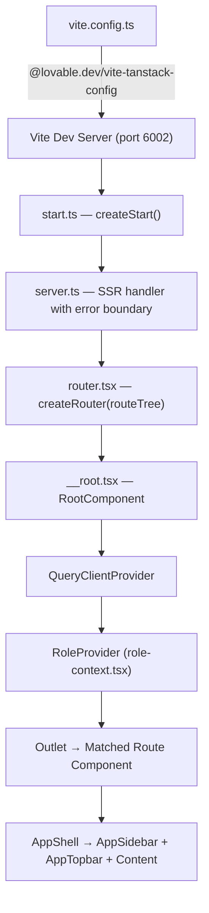
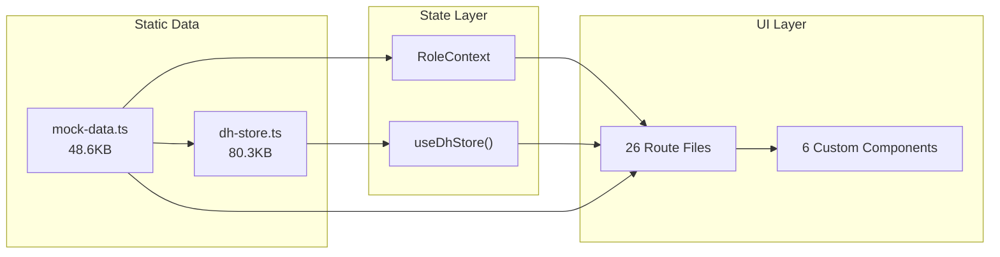

# Repository Analysis

> **Analyzed by:** Principal Software Architect  
> **Date:** 2026-06-16  
> **Scope:** Complete repository scan of Project Compass (Pulse PMO)

---

## 1. Project Purpose

Project Compass (internal name: **Pulse PMO**) is an enterprise-grade **Project Management, Resource Allocation, Finance, Governance, and Approval Workflow** platform designed for IT service companies and professional services organizations. It manages the complete lifecycle:

```
Client → Project → WBS → Resource Allocation → Tasks → Timesheets → Invoices → Payment → Closure
```

---

## 2. Technology Stack

### Core Runtime
| Technology | Version | Role |
|-----------|---------|------|
| React | 19.2.0 | UI framework |
| TypeScript | 5.8.3 | Type safety |
| Vite | 7.3.1 | Build tool / dev server |
| TanStack Start | 1.167.50 | SSR framework (Cloudflare Workers target) |
| TanStack Router | 1.168.25 | File-based routing |
| React Query | 5.83.0 | Async state (prepared for API, unused for data fetching) |

### Styling
| Technology | Version | Role |
|-----------|---------|------|
| Tailwind CSS | 4.2.1 | Utility-first CSS |
| tw-animate-css | 1.3.4 | Animation utilities |
| shadcn/ui (new-york) | Latest | Pre-built Radix components |
| Lucide React | 0.575.0 | Icon library |

### Forms & Validation
| Technology | Version | Role |
|-----------|---------|------|
| React Hook Form | 7.71.2 | Form state management |
| Zod | 3.24.2 | Schema validation |
| @hookform/resolvers | 5.2.2 | Zod ↔ RHF bridge |

### Data Visualization
| Technology | Version | Role |
|-----------|---------|------|
| Recharts | 2.15.4 | Charts & analytics |

### Notifications
| Technology | Version | Role |
|-----------|---------|------|
| Sonner | 2.0.7 | Toast notifications |

### Build & Deploy
| Technology | Version | Role |
|-----------|---------|------|
| @cloudflare/vite-plugin | 1.25.5 | Cloudflare Workers deployment |
| @lovable.dev/vite-tanstack-config | 1.5.1 | Preconfigured Vite setup |
| ESLint | 9.32.0 | Linting |
| Prettier | 3.7.3 | Code formatting |

### Package Management
- **Primary lockfile:** `bun.lock` (184KB) — Bun is the intended package manager
- **Secondary lockfile:** `package-lock.json` (363KB) — npm fallback present
- **Node modules:** Installed and present

---

## 3. Monorepo Directory Structure

```
project-compass/
├── apps/
│   ├── frontend/                 # React 19 + TanStack Start application
│   │   ├── src/                  # Main application source
│   │   ├── package.json          # NPM package manifest
│   │   ├── package-lock.json     # npm lockfile
│   │   ├── tsconfig.json         # TypeScript config
│   │   ├── vite.config.ts        # Vite config
│   │   ├── eslint.config.js      # ESLint config
│   │   ├── components.json       # shadcn/ui config
│   │   └── wrangler.jsonc        # Cloudflare Workers config
│   └── backend/                  # FastAPI backend (empty scaffold)
├── wiki/                         # Obsidian Knowledge Base
├── scripts/                      # Restructuring and other utility scripts
├── tools/                        # Developer tooling
├── .gitignore                    # Monorepo-aware gitignore
├── .prettierrc                   # Shared Prettier config
├── .prettierignore               # Shared Prettier ignore
├── .vscode/                      # VSCode workspaces settings
└── README.md                     # Proper project README
```

---

## 4. Source Code Architecture

### `apps/frontend/src/` Directory (Application Core)

```
apps/frontend/src/
├── components/                  # React components
│   ├── ui/                      # 46 shadcn/ui base components
│   │   ├── accordion.tsx
│   │   ├── alert-dialog.tsx
│   │   ├── badge.tsx
│   │   ├── button.tsx
│   │   ├── calendar.tsx
│   │   ├── card.tsx
│   │   ├── chart.tsx
│   │   ├── dialog.tsx
│   │   ├── dropdown-menu.tsx
│   │   ├── sidebar.tsx          # 24KB — full sidebar system
│   │   ├── sonner.tsx
│   │   ├── table.tsx
│   │   ├── tabs.tsx
│   │   └── ... (46 total)
│   ├── app-shell.tsx            # Layout wrapper (654B — thin)
│   ├── app-sidebar.tsx          # Navigation (4.6KB, role-conditional)
│   ├── app-topbar.tsx           # Header bar (3KB)
│   ├── mobile-tabs.tsx          # Mobile bottom nav (2.8KB)
│   ├── pills.tsx                # Status badges (4.4KB)
│   └── stage-tracker.tsx        # Project stage pipeline (8.5KB)
├── hooks/
│   └── use-mobile.tsx           # Responsive breakpoint hook (576B)
├── lib/
│   ├── mock-data.ts             # ALL DOMAIN DATA (48.6KB, 1100+ lines)
│   ├── dh-store.ts              # Dhanshree workflow store (80.3KB, 2141 lines)
│   ├── dh-helpers.ts            # Team derivation helpers (4.6KB)
│   ├── role-context.tsx         # Role provider + data filtering (2.6KB)
│   ├── utils.ts                 # cn() utility (169B)
│   ├── error-capture.ts         # Error capture singleton (906B)
│   └── error-page.ts            # Branded error HTML (1.4KB)
├── routes/                      # 26 route files
│   ├── __root.tsx               # Root layout (4.7KB)
│   ├── index.tsx                # Dashboard (13.9KB)
│   ├── clients.index.tsx        # Client list (5.5KB)
│   ├── clients.$clientId.tsx    # Client detail (5.6KB)
│   ├── projects.index.tsx       # Project list — Dhanshree (38.2KB)
│   ├── projects.new.tsx         # New project form (58.2KB)
│   ├── projects.$projectId.tsx  # Project detail (167.6KB — LARGEST FILE)
│   ├── portfolio.tsx            # Portfolio view (7.5KB)
│   ├── wbs-allocation.tsx       # WBS allocation — PMO (35.1KB)
│   ├── health.tsx               # Health & governance (22.6KB)
│   ├── approvals.tsx            # Timesheet approvals (11KB)
│   ├── reports.tsx              # Analytics (20.4KB)
│   ├── resources.tsx            # Resource directory (6KB)
│   ├── timesheet.tsx            # Timesheet entry (7KB)
│   ├── allocation.tsx           # Allocation view (10.6KB)
│   ├── action-centre.tsx        # Action centre — Dhanshree (83.2KB)
│   ├── customers.tsx            # Customer list (17.3KB)
│   ├── customers.$clientId.tsx  # Customer detail (22.6KB)
│   ├── customer-detail.$clientId.tsx  # ⚠️ Duplicate variant (22.6KB)
│   ├── dh-reports.tsx           # Reports — Dhanshree (16KB)
│   ├── dh-resources.tsx         # Resources — Dhanshree (31.3KB)
│   ├── health-additional-requirements.tsx  # Additional requirements (17.3KB)
│   ├── health-interview-scheduling.tsx     # Interview scheduling (16.6KB)
│   ├── wbs-prerequisite-new.tsx            # WBS prerequisite form (25KB)
│   ├── -wbs-prerequisite-new.tsx           # ⚠️ Disabled duplicate (25KB)
│   └── -projects..tsx                      # ⚠️ Disabled route fragment (155B)
├── routeTree.gen.ts             # Auto-generated route tree (18.8KB)
├── router.tsx                   # Router factory (394B)
├── server.ts                    # SSR server handler (2.6KB)
├── start.ts                     # TanStack Start entry (619B)
├── styles.css                   # Design tokens + Tailwind config (6.2KB)
└── vite-env.d.ts                # Vite type declarations (38B)
```

---

## 5. Entry Points & Bootstrap Flow



**Key observations:**
1. `vite.config.ts` uses `@lovable.dev/vite-tanstack-config` which bundles TanStack Start, React, Tailwind, tsconfig paths, Cloudflare plugin, and error logging
2. `server.ts` wraps the SSR handler with catastrophic error detection (catches h3-swallowed errors)
3. `start.ts` adds error middleware that returns branded error pages
4. `router.tsx` creates the router from auto-generated `routeTree.gen.ts`
5. `__root.tsx` provides `QueryClientProvider`, `RoleProvider`, and `Toaster`

---

## 6. Data Flow Architecture

### Current (Frontend-Only)



**Critical observation:** Data flows in ONE direction only — from static TypeScript files to UI. There are NO API calls. All "mutations" are local state changes that persist only in SPA memory and are lost on page refresh.

---

## 7. Dependency Analysis

### Production Dependencies: 40 packages
- **Framework:** 4 (React, React DOM, TanStack Router, TanStack Start)
- **State:** 1 (React Query — present but only used for QueryClientProvider, no queries)
- **UI Components:** 19 (Radix primitives via shadcn/ui)
- **Styling:** 4 (Tailwind, tailwind-merge, clsx, tw-animate-css)
- **Forms:** 3 (React Hook Form, Zod, hookform resolvers)
- **Charts:** 1 (Recharts)
- **Utils:** 5 (date-fns, cmdk, lucide-react, sonner, vaul)
- **Build:** 3 (Cloudflare plugin, Tailwind Vite, tsconfig paths)

### DevDependencies: 11 packages
- ESLint + plugins, Prettier, TypeScript, Vite, React types

### Unused/Underutilized Dependencies
| Package | Status | Notes |
|---------|--------|-------|
| `@tanstack/react-query` | Underutilized | Provider mounted but no `useQuery`/`useMutation` calls |
| `react-hook-form` + `@hookform/resolvers` | Partially used | Only in `projects.new.tsx` |
| `cmdk` | Installed | Command palette component available but not integrated into app UI |
| `react-resizable-panels` | Installed | Not observed in use |
| `embla-carousel-react` | Installed | Carousel component available, not used in routes |
| `input-otp` | Installed | OTP input component, not used |
| `react-day-picker` | Installed | Calendar picker, used via shadcn calendar |
| `vaul` | Installed | Drawer component, available but not used in routes |

---

## 8. File Size Analysis (Critical Hotspots)

| File | Size | Lines | Risk Level |
|------|------|-------|-----------|
| `projects.$projectId.tsx` | **167.6KB** | 3,193 | 🔴 CRITICAL — Single file contains 15+ components, 6 tabs |
| `action-centre.tsx` | **83.2KB** | ~2,000 | 🔴 CRITICAL — 8 sub-modules in one file |
| `dh-store.ts` | **80.3KB** | 2,141 | 🔴 CRITICAL — Monolithic state store |
| `projects.new.tsx` | **58.2KB** | ~1,200 | 🟠 HIGH — Complex form |
| `mock-data.ts` | **48.6KB** | 1,100+ | 🟠 HIGH — All domain data bundled |
| `projects.index.tsx` | **38.2KB** | ~800 | 🟠 HIGH |
| `wbs-allocation.tsx` | **35.1KB** | 719 | 🟡 MEDIUM |
| `dh-resources.tsx` | **31.3KB** | ~800 | 🟡 MEDIUM |

**Total route file size:** ~668KB of TSX across 26 files  
**Total source size:** ~810KB (excluding node_modules, dist, generated files)

---

## 9. Technical Observations

### Positive
1. **TypeScript strict mode** enabled with good type coverage
2. **Consistent UI library** (shadcn/ui + Tailwind) provides design system coherence
3. **File-based routing** via TanStack Router is clean and predictable
4. **SEO-aware** — each route defines `head()` with title and meta description
5. **Error boundaries** exist at both SSR and client levels
6. **Dark mode support** — full light/dark CSS variable system with oklch colors

### Negative (Technical Debt)
1. **No backend** — entire app runs on 129KB of static TypeScript data
2. **167KB route file** — `projects.$projectId.tsx` is unmaintainable at current size
3. **No authentication** — role switching is a dropdown; any role is accessible
4. **No tests** — zero test files, no test framework installed
5. **Dual lockfiles** — `bun.lock` AND `package-lock.json` creates confusion
6. **Orphan files** — `simple-server.cjs`, `simple-server.js`, `wbstabhtml.txt`, `simplified-app/` are dead weight
7. **Duplicate routes** — `customer-detail.$clientId.tsx` appears to duplicate `customers.$clientId.tsx`; `-wbs-prerequisite-new.tsx` and `-projects..tsx` are disabled duplicates
8. **No environment variables** — no `.env` or `.env.example` file
9. **README.md is empty** — contains only "Lovable App" (10 bytes)
10. **Lovable.dev coupling** — build depends on `@lovable.dev/vite-tanstack-config` which abstracts away critical Vite configuration

---

## 10. Configuration Matrix

| Config File | Purpose | Status |
|------------|---------|--------|
| `vite.config.ts` | Build system | ✅ Active — uses Lovable preset |
| `tsconfig.json` | TypeScript | ✅ Active — strict, ES2022, `@/*` paths |
| `eslint.config.js` | Linting | ✅ Active — flat config, React hooks, Prettier |
| `.prettierrc` | Formatting | ✅ Active — 100 width, double quotes |
| `components.json` | shadcn/ui | ✅ Active — new-york style, slate base |
| `wrangler.jsonc` | Cloudflare Workers | ⚠️ Present but deployment not actively used |
| `.gitignore` | Git | ✅ Active |
| `bun.lock` | Bun lockfile | ⚠️ Present alongside npm lockfile |
| `package-lock.json` | npm lockfile | ⚠️ Dual lockfile situation |

---

## Related Documents

- [[Frontend_Architecture]] — How the frontend works
- [[RUNNING_THE_PROJECT]] — How to run locally
- [[Repository_Improvement_Plan]] — Restructuring recommendations
- [[Backend_Master_Plan]] — Future backend design
