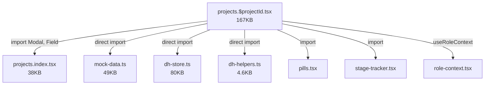

# Repository Improvement Plan

> **Priority:** High — Must address before backend development  
> **Date:** 2026-06-16  
> **Context:** All frontend paths described in this document are relative to `apps/frontend/` unless otherwise specified.

---

## 1. Current Structure Assessment

### Problems Identified

| # | Problem | Severity | Impact |
|---|---------|----------|--------|
| 1 | **167KB route file** (`projects.$projectId.tsx`) | 🔴 Critical | Unmaintainable, slow IDE performance |
| 2 | **83KB route file** (`action-centre.tsx`) | 🔴 Critical | 8 modules in one file |
| 3 | **80KB store** (`dh-store.ts`) | 🔴 Critical | Monolithic state, impossible to test |
| 4 | **All data in one file** (`mock-data.ts` — 49KB) | 🟠 High | Bundled into client JS, not modular |
| 5 | **Orphan files** in root | 🟡 Medium | Confusing repository layout |
| 6 | **Dual lockfiles** | 🟡 Medium | Dependency inconsistency risk |
| 7 | **Duplicate routes** | 🟡 Medium | Dead code confusion |
| 8 | **No feature-based organization** | 🟡 Medium | Flat route directory, no colocation |
| 9 | **No tests** | 🔴 Critical | Zero confidence in refactoring |
| 10 | **Empty README** | 🟡 Medium | No onboarding guidance |

### Tight Coupling Analysis



The project detail page has **7 direct import dependencies** — it's the nexus of the entire application.

---

## 2. Recommended Structure

### Current (Flat)
```
src/
├── components/        # 6 custom + 46 shadcn
├── hooks/             # 1 file
├── lib/               # 7 files (data + state + utils)
└── routes/            # 26 flat files
```

### Recommended (Feature-Modular)
```
src/
├── app/                              # App shell & infrastructure
│   ├── layout/
│   │   ├── app-shell.tsx
│   │   ├── app-sidebar.tsx
│   │   ├── app-topbar.tsx
│   │   └── mobile-tabs.tsx
│   ├── providers/
│   │   ├── query-provider.tsx        # QueryClient setup
│   │   └── role-provider.tsx         # RoleContext (moved from lib)
│   └── errors/
│       ├── error-capture.ts
│       ├── error-page.ts
│       └── not-found.tsx
│
├── features/                         # Feature modules (business logic)
│   ├── dashboard/
│   │   ├── components/
│   │   │   ├── stat-card.tsx
│   │   │   ├── project-summary.tsx
│   │   │   └── executive-panel.tsx
│   │   └── index.tsx                 # Dashboard page
│   │
│   ├── clients/
│   │   ├── components/
│   │   │   ├── client-card.tsx
│   │   │   └── client-detail.tsx
│   │   ├── client-list.page.tsx
│   │   └── client-detail.page.tsx
│   │
│   ├── projects/
│   │   ├── components/
│   │   │   ├── overview-tab.tsx      # Extracted from 167KB file
│   │   │   ├── wbs-tab.tsx
│   │   │   ├── tasks-tab.tsx
│   │   │   ├── team-tab.tsx
│   │   │   ├── health-tab.tsx
│   │   │   ├── invoices-tab.tsx
│   │   │   ├── stage-tracker.tsx
│   │   │   ├── extension-request.tsx
│   │   │   ├── prerequisite-section.tsx
│   │   │   └── modal.tsx
│   │   ├── project-list.page.tsx
│   │   ├── project-detail.page.tsx   # Now thin — imports tabs
│   │   └── project-new.page.tsx
│   │
│   ├── wbs/
│   │   ├── components/
│   │   │   ├── wbs-inbox.tsx
│   │   │   ├── allocation-board.tsx
│   │   │   └── smart-suggestions.tsx
│   │   └── wbs-allocation.page.tsx
│   │
│   ├── health/
│   │   ├── components/
│   │   │   ├── issue-list.tsx
│   │   │   ├── issue-detail.tsx
│   │   │   └── user-tag-picker.tsx
│   │   └── health.page.tsx
│   │
│   ├── timesheets/
│   │   ├── components/
│   │   │   ├── timesheet-grid.tsx
│   │   │   └── approval-detail.tsx
│   │   ├── timesheet.page.tsx
│   │   └── approvals.page.tsx
│   │
│   ├── finance/
│   │   ├── components/
│   │   │   └── invoice-table.tsx
│   │   └── (integrated into project detail)
│   │
│   ├── resources/
│   │   ├── components/
│   │   │   ├── resource-card.tsx
│   │   │   ├── onboarding-table.tsx
│   │   │   └── offboarding-table.tsx
│   │   ├── resources.page.tsx
│   │   └── dh-resources.page.tsx
│   │
│   ├── reports/
│   │   ├── components/
│   │   │   └── chart-panels.tsx
│   │   ├── reports.page.tsx
│   │   └── dh-reports.page.tsx
│   │
│   └── action-centre/               # Split from 83KB file
│       ├── components/
│       │   ├── issues-tab.tsx
│       │   ├── alerts-tab.tsx
│       │   ├── escalations-tab.tsx
│       │   ├── appreciations-tab.tsx
│       │   ├── interviews-tab.tsx
│       │   ├── requirements-tab.tsx
│       │   ├── approvals-tab.tsx
│       │   └── timesheets-tab.tsx
│       └── action-centre.page.tsx    # Now thin — imports tabs
│
├── shared/                           # Shared UI components
│   ├── ui/                           # shadcn/ui (unchanged)
│   ├── pills.tsx                     # Status badges
│   └── modal.tsx                     # Shared modal component
│
├── data/                             # Data layer (replace lib/)
│   ├── mock/
│   │   ├── people.ts                 # Split from mock-data.ts
│   │   ├── clients.ts
│   │   ├── projects.ts
│   │   ├── issues.ts
│   │   ├── timesheets.ts
│   │   ├── invoices.ts
│   │   ├── wbs-requests.ts
│   │   ├── resources.ts
│   │   └── index.ts                  # Re-exports all
│   ├── stores/
│   │   ├── issues-store.ts           # Split from dh-store.ts
│   │   ├── alerts-store.ts
│   │   ├── approvals-store.ts
│   │   ├── timesheets-store.ts
│   │   ├── invoices-store.ts
│   │   ├── resources-store.ts
│   │   ├── prerequisites-store.ts
│   │   └── project-stages-store.ts
│   ├── helpers/
│   │   ├── team-helpers.ts           # From dh-helpers.ts
│   │   ├── task-helpers.ts
│   │   └── department-helpers.ts
│   └── types/                        # Shared TypeScript types
│       ├── entities.ts
│       ├── enums.ts
│       └── api.ts                    # Future API response types
│
├── hooks/
│   ├── use-mobile.tsx
│   └── use-role.tsx                  # Hook wrapper for role context
│
├── routes/                           # TanStack Router route files (thin)
│   ├── __root.tsx
│   ├── index.tsx                     # → features/dashboard/
│   ├── clients.index.tsx             # → features/clients/
│   ├── clients.$clientId.tsx         # → features/clients/
│   ├── projects.index.tsx            # → features/projects/
│   ├── projects.$projectId.tsx       # → features/projects/
│   └── ... (each route imports from features/)
│
├── lib/
│   └── utils.ts                      # cn() utility
│
├── router.tsx
├── server.ts
├── start.ts
└── styles.css
```

---

## 3. Migration Plan

### Phase 1: Eliminate Dead Code (1 day)
- [ ] Delete `simple-server.cjs`, `simple-server.js`
- [ ] Delete `wbstabhtml.txt`
- [ ] Delete `simplified-app/` directory
- [ ] Delete `-wbs-prerequisite-new.tsx`, `-projects..tsx` (disabled routes)
- [ ] Resolve `customer-detail.$clientId.tsx` vs `customers.$clientId.tsx` duplicate
- [ ] Remove one lockfile (keep `package-lock.json`, delete `bun.lock`, or vice versa)
- [ ] Write proper `README.md`

### Phase 2: Split Critical Files (3-5 days)
- [ ] Extract 6 tab components from `projects.$projectId.tsx` into `features/projects/components/`
- [ ] Extract 8 tab components from `action-centre.tsx` into `features/action-centre/components/`
- [ ] Split `dh-store.ts` into domain-specific stores
- [ ] Split `mock-data.ts` into per-entity files

### Phase 3: Feature Module Organization (2-3 days)
- [ ] Create `features/` directory structure
- [ ] Move route logic into feature modules
- [ ] Make route files thin (import from features)
- [ ] Create shared component directory

### Phase 4: Infrastructure (2 days)
- [ ] Create `app/` directory for layout and providers
- [ ] Create `data/` directory for data layer
- [ ] Create `data/types/` for shared TypeScript types
- [ ] Create `.env.example` template

---

## 4. Risks

| Risk | Mitigation |
|------|-----------|
| Route tree generation breaks after file moves | Run `npm run dev` after each move to regenerate `routeTree.gen.ts` |
| Import paths break | Use `@/*` path aliases consistently; IDE refactoring tools |
| Component extraction breaks shared state | Extract state hooks alongside components |
| Build breaks during migration | Make atomic commits; test after each phase |
| No tests to catch regressions | Manual smoke testing per route until test framework is added |

---

## 5. Benefits

| Benefit | Impact |
|---------|--------|
| Files under 500 lines each | IDE performance, code review feasibility |
| Feature-based organization | New developers find code by business domain |
| Isolated stores per domain | Independent testing, smaller mental model |
| Route files become thin | Route definitions separate from business logic |
| Backend integration points clear | Each feature module maps to API endpoints |
| Test structure mirrors feature structure | `features/projects/__tests__/` |

---

## 6. Priority Order

1. **Delete dead code** — Zero risk, immediate cleanup
2. **Split `projects.$projectId.tsx`** — Highest impact (167KB → 6 files)
3. **Split `action-centre.tsx`** — Second highest impact (83KB → 8 files)
4. **Split `dh-store.ts`** — Required for backend migration
5. **Split `mock-data.ts`** — Required for incremental API migration
6. **Create feature modules** — Organizational improvement
7. **Create data layer** — Foundation for backend integration

---

## Related Documents

- [[Repository_Analysis]] — Current state analysis
- [[Backend_Master_Plan]] — Backend architecture
- [[28_Development_Roadmap]] — Phased roadmap
